# Textual hawkishness of FOMC chair openings

**run_id:** `fedjev-2026-09-20`  
**model:** jev-1.13.0 (TypeSafe SystemOne)  
**criterion (exact):** `more hawkish about inflation`  
**repository:** [maybern-tripp-smith/fedjev-bench](https://github.com/maybern-tripp-smith/fedjev-bench)  
**pages:** [https://maybern-tripp-smith.github.io/fedjev-bench/](https://maybern-tripp-smith.github.io/fedjev-bench/)

Companion gate tables: [`REPORT.md`](REPORT.md). Machine-readable estimates: [`results/gates.json`](results/gates.json). Estimator glossary: [`results/interpretation.json`](results/interpretation.json). FedLock matching and fidelity: [`results/fedlock_fidelity.md`](results/fedlock_fidelity.md).

---

## Abstract

Same-day changes in the federal funds target are a convenient but incomplete label for the hawkishness of Federal Open Market Committee (FOMC) communication. Policy actions and textual stance often co-move on scheduled action days. They need not coincide when the Committee leaves the target unchanged.

This note reports a pre-registered evaluation of TypeSafe/Jev on chair press-conference openings. The protocol is pairwise Choice under the fixed criterion string `more hawkish about inflation`, presented in both orders, aggregated by Bradley–Terry (BT), with a secondary direct Score pass. Seven gates examine construct validity on rate-extreme pairs, rank agreement with same-day target moves, separation of holds from cuts on the text axis, forward-path correlation, order and name stability, and external consistency with an independent text score (FedLock).

Primary quantities are reported with standard errors (STE) and, where applicable, bootstrap percentile confidence intervals. Gate 4 is a construct-validity result: when the target is unchanged, `d_same` is identically zero and cannot encode hawkish- versus dovish-hold language. Gate 7 is Spearman agreement with FedLock raw (`m`) and era-adjusted (`ma`) scores. It is not a TrueSkill or macro-conditioned methodological replication.

Experiments 3–7 hold the corpus, gold pairs, and inflation-hawkishness criterion family fixed and vary the question interface: a four-dimension Score composite, multi-label Nouls, criterion paraphrases, span Choice, and macro-conditioned Choice. A separate TrueSkill protocol replica is reported under Results. It does not replace Gate 7.

---

## Contributions

Work on FOMC language often treats the realized same-day target-rate change as a proxy for how hawkish a communication was. That proxy mixes two constructs, defined once here and used throughout.

The **behavioral measure** is the Committee’s voted action. The series used below is `d_same`, the same-day change in the funds target (hike, hold, or cut), together with dissent counts where available.

The **textual measure** is the stance expressed in the Chair’s opening remarks about inflation, the labor market, and the policy path, recovered under a fixed pairwise criterion.

On scheduled action days the two series frequently align. On holds (`d_same = 0`), and across regimes—for example 2020 easing communications versus 2022–23 holds with hawkish inflation language—alignment is not guaranteed. The evaluation therefore reports:

1. A pre-registered pairwise protocol under a fixed criterion, with pass/fail on Gates 1, 3, 4, and 6 (Gates 2, 5, and 7 report-only or secondary).
2. Rank agreement between the textual measure and `d_same` on scheduled action days (Gate 3).
3. A construct-validity result that same-day funds-rate changes are an incomplete label for textual hawkishness when the target is unchanged (Gate 4).
4. Spearman agreement with an independent FedLock text score, distinguished from TrueSkill or macro-conditioned replication (Gate 7).
5. Interface probes (Experiments 3–7) that hold gold labels fixed.

The note is a measurement exercise. It does not identify a causal effect of communication on rates, markets, or subsequent policy.

---

## Methods

### Related measurements

| Work | Contribution | Use in this evaluation |
|------|--------------|------------------------|
| **jsort** ([keltokhy/jsort](https://github.com/keltokhy/jsort)) | Statement ranking; published Spearman versus same-day move ≈ **+0.46** | Label formulas (`d_same`, `d_90`, `d_2y`); Gate 3 signal line (+0.30) and published reference (+0.46) |
| **Shah et al.** ([gtfintechlab/fomc-hawkish-dovish](https://github.com/gtfintechlab/fomc-hawkish-dovish); CC BY-NC 4.0) | Sentence-level hawk/dove/neutral labels | Stratum B; Gate 2 report-only |
| **FedLock** ([jnathan9.github.io/fedlock](https://jnathan9.github.io/fedlock/)) | Independent LLM pairwise tournament with TrueSkill scores | Gate 7 external consistency (report-only); see Results |

jsort supplies the behavioral-label algebra and a published rank-correlation reference. Shah supplies sentence gold for a sentence-level diagnostic that is not used to pass or fail the document-level claim. FedLock supplies an independent meeting-day text score. None of these sources is treated as a ground-truth hawkishness index.

### Data

| Corpus | Path | Role |
|--------|------|------|
| Chair press-conference openings | `data/clean/statements.jsonl` (~95 documents) | Document-level Choice and Score |
| Shah sentences | `data/clean/sentences.jsonl` | Stratum B |
| Meeting calendar and FRED labels | `data/labels/meetings.parquet` | `d_same`, `d_90`, `d_2y`, dissent counts, exclusions |
| FedLock snapshot | `data/raw/fedlock/data.json` | Gate 7 (`m`, `ma`, `s`, `st`) |
| FRED CSVs | `data/raw/fred/` | DFEDTARU, DGS2 |

**Labels (jsort-aligned).** `d_same` = DFEDTARU[t+1] − DFEDTARU[t−1]. `y_action` = sign(`d_same`). `d_90` = DFEDTARU[t+90] − DFEDTARU[t]. `d_2y` = DGS2[t] − DGS2[t−1].

**Exclusions (pre-registered).** Drop 2020-03-03 and 2020-03-15 (unscheduled) and other `exclude_main` or unscheduled rows from the main analysis. Flag 2023-03-22 (SVB) without dropping.

**Gold strata (frozen before scoring).** A, extreme document pairs, n=40. B, Shah hawk versus dove sentences, n=200, seed 20260920. C, adjacent scheduled meetings with nonzero change in `d_same`, n=22. Manifest: `data/pairs/PAIR_MANIFEST.md`.


*Figure 1. Direct Score (`score_jev`) on scheduled openings in the main sample (crisis dates dropped; n=93). Marker shape is the same-day action: hike, hold, or cut. The teal circle marks 2023-03-22 (SVB), which is flagged and retained. Holds occupy a wide range of text scores even though `d_same` is zero.*

---

### Protocol

**Choice (primary).** Criterion string: `more hawkish about inflation`. Each gold pair is presented in both orders (`ab` and `ba`). Choice probabilities are mapped to the gold side and averaged. An inversion is an averaged winner that does not match gold. Chair names and ISO dates are stripped (`scripts/strip_meta.py`).

**Score (secondary).** A five-level ordinal rating is mapped to a continuous `score_jev` for each opening.

**Bradley–Terry.** BT scores use Strata A and C Choice probabilities. Shah pairs are excluded because they are sentence-level. This run: n_statements=**48**, n_comparisons=**124**, converged=True, position bias γ=**-0.1378**. The comparison graph is sparse. The BT `se` in `statement_scores.csv` is fit uncertainty from the pairwise likelihood, not a meeting-sampling STE.

**Uncertainty.** Spearman: bootstrap STE (standard deviation of 1,000 meeting resamples) and percentile 95 percent confidence interval. Inversion: binomial STE √[p(1−p)/n]. Means and Brier scores: STE = sd/√n. Gate 4 gap STE = √(ste_holds² + ste_cuts²).

---

## Results

### Pre-registered gates

| # | Gate | Pass line | Result |
|---|------|-----------|--------|
| 1 | Easy-pair inversion (A) | ≤ 0.05 | **PASS** — rate=0.0000 (n=40, STE=0.0000) |
| 2 | Sentence discrimination (B) | report | inv=0.1900 STE=0.0277; Brier=0.1384 STE=0.0156 (n=200) |
| 3 | Action ranking | Spearman ≥ +0.30 | **PASS** — BT all=+0.623 (n=46, STE=0.096) [+0.398, +0.787]; action=+0.851 (n=24, STE=0.074) [+0.652, +0.937] |
| 4 | Holds versus cuts | mean(holds) > mean(cuts) | **PASS** — BT gap=+0.519 STE=0.368 (n_h=22, n_c=8) |
| 5 | Forward path (`d_90`) | secondary | BT=+0.357 (n=44, STE=0.154) [+0.042, +0.627]; score_jev=+0.511 (n=91, STE=0.081) [+0.336, +0.652] |
| 6 | Order/name stability | Δ inv ≤ 0.05 | **PASS** — Δ=0.0000 |
| 7 | FedLock consistency | report | BT vs m=+0.679 (n=46, STE=0.112) [+0.436, +0.861]; vs ma=+0.594 (n=46, STE=0.104) [+0.361, +0.770]; score_jev vs m=+0.944 (n=90, STE=0.016) [+0.900, +0.966]; vs ma=+0.774 (n=90, STE=0.044) [+0.673, +0.839] |

### Inversion by stratum

| Stratum | n | inverted | inversion (STE) | mean p(gold) | mean Brier (STE) | order-flip |
|---------|--:|--------:|----------------:|-------------:|-----------------:|-----------:|
| A extreme | 40 | 0 | 0.000 (0.000) | 1.000 | 0.000 (0.000) | 0.000 |
| B Shah | 200 | 38 | 0.190 (0.028) | 0.745 | 0.138 (0.016) | 0.105 |
| C adjacent | 22 | 1 | 0.045 (0.044) | 0.855 | 0.046 (0.018) | 0.091 |

Stratum A has no inversions. The inverted adjacent pair is **C018**. Gate 2 (19 percent inversion) is a sentence-level diagnostic. It is not a pass/fail of the document-level claim.


*Figure 2. Inversion rate by gold stratum, Jev versus Haiku 4.5 under the same pairs and criterion. Error bars are binomial STE √[p(1−p)/n]. The dashed line is the Gate 1 pass line (0.05). Stratum A is zero for both models (n=40, STE=0). Stratum B: Jev 0.190 (STE 0.028, n=200); Haiku 0.170 (n=200). Stratum C: 0.045 (STE 0.044, n=22) for both.*


*Figure 3. Distribution of averaged two-order p(gold) by stratum. The dashed line is 0.5. Stratum A is a point mass at 1.0 (n=40). Stratum B (n=200) has interior probabilities. Stratum C (n=22) is concentrated above 0.5.*


*Figure 4. Choice accuracy (1 − inversion) versus a 0.5 chance line. Error bars are the binomial STE of the inversion rate. A: 1.000 (n=40). B: 0.810 (STE 0.028, n=200). C: 0.955 (STE 0.044, n=22).*


*Figure 5. Left: Stratum B confidence diagnostic. Gold-pair frequency is identically 1 by construction of the gold set, so the panel plots bin-mean p(gold) against 1. ECE is the bin-weighted |1 − p̄| = 0.255 (n=200). This is not a reliability curve versus an independent outcome; inversion is a function of the same p. Right: mean Brier ± STE. A: 0.000 (n=40). B: 0.138 (STE 0.016, n=200). C: 0.046 (STE 0.018, n=22). Criterion-paraphrase |Δp| is reported in Experiment 5 (Figure 16).*

### Gate 3 — rank agreement with policy actions

| Slice | BT Spearman ρ [STE; 95% CI] | n |
|-------|------------------------------|--:|
| All scheduled (excl. crisis) | +0.623 (n=46, STE=0.096) [+0.398, +0.787] | 46 |
| action_days (`d_same`≠0) | +0.851 (n=24, STE=0.074) [+0.652, +0.937] | 24 |
| hold_days vs (n_hawk−n_dove) | −0.192 (n=22, STE=0.202) [−0.513, +0.274] | 22 |
| hold_days vs `d_2y` | −0.135 (n=22, STE=0.244) [−0.594, +0.349] | 22 |

Secondary `score_jev`: all=+0.589 (n=93, STE=0.063) [+0.460, +0.701]; action=+0.918 (n=30, STE=0.033) [+0.812, +0.953].

Action-day ρ exceeds all-scheduled ρ because holds contribute no variation in `d_same`. Spearman versus `d_same` on holds alone is undefined and is not computed. Hold-day associations with net dissents and `d_2y` are weak. That pattern is consistent with holds mixing hawkish-hold and dovish-hold communications.

The jsort published reference is Spearman ≈ +0.46 (STE not re-estimated here). BT action-day ρ=+0.851 (STE=0.074) exceeds both the pre-registered +0.30 line and that published point estimate. Bootstrap intervals on the action-day and all-scheduled slices exclude zero.


*Figure 6. Meeting-level text scores against `d_same` on scheduled meetings excluding unscheduled crisis dates. Left: Bradley–Terry (n=46). Right: `score_jev` (n=93). Triangles are action days; circles are holds (`d_same` = 0). The teal outline is 2023-03-22 (SVB). Spearman ρ and bootstrap STE are the Gate 3 all-scheduled estimates. Holds form a vertical stack because the behavioral label does not vary.*


*Figure 7. BT Spearman ρ with bootstrap percentile 95 percent intervals. All scheduled: +0.623 (n=46, STE=0.096). Action days: +0.851 (n=24, STE=0.074). Hold-day contrasts versus dissent net and `d_2y` have intervals that include zero. Vertical lines mark the pre-registered +0.30 pass line and the jsort published point estimate +0.46.*

### Gate 4 — holds versus cuts on the text axis

| Score | mean holds (STE, n) | mean cuts (STE, n) | mean hikes (STE, n) | gap holds−cuts (STE) |
|-------|---------------------|--------------------|---------------------|----------------------|
| BT | −0.720 (0.335, 22) | −1.239 (0.153, 8) | 1.827 (0.532, 16) | +0.519 (0.368) |
| score_jev | 1.457 (0.114, 63) | 1.036 (0.122, 9) | 3.067 (0.135, 21) | +0.421 (0.167) |

Under holds, `d_same` is identically zero. It therefore cannot encode hawkish- versus dovish-hold communications. A higher mean text score on holds than on cuts indicates that the textual measure separates these regimes where the same-day behavioral label cannot.

This is a construct-validity result: same-day funds-rate changes are an incomplete label for textual hawkishness when the target is unchanged. It is not a claim that text overrides the voted action, nor a judgment of policy correctness.

The BT gap 95 percent interval includes zero ([−0.202, +1.239]). The `score_jev` gap interval does not ([+0.094, +0.749]). The pre-registered pass rule is the point comparison mean(holds) > mean(cuts).


*Figure 8. Mean text scores by same-day action, ± STE (sd/√n). Left, BT: cuts −1.239 (STE 0.153, n=8); holds −0.720 (STE 0.335, n=22); hikes +1.827 (STE 0.532, n=16); holds−cuts gap +0.519 (STE 0.368). Right, `score_jev`: cuts 1.036 (STE 0.122, n=9); holds 1.457 (STE 0.114, n=63); hikes 3.067 (STE 0.135, n=21); gap +0.421 (STE 0.167). Mean hold scores exceed mean cut scores on both scales.*

### Gate 5 — forward path

BT versus `d_90`: +0.357 (n=44, STE=0.154) [+0.042, +0.627]. `score_jev` versus `d_90`: +0.511 (n=91, STE=0.081) [+0.336, +0.652]. The gate is secondary.


*Figure 9. Text scores against the 90-day subsequent change in the funds target (`d_90`). Markers follow the same-day action, not the forward path. Left: BT, n=44. Right: `score_jev`, n=91. Spearman ρ and bootstrap STE are the Gate 5 estimates. Intervals exclude zero on both slices.*

### Gate 6 — name ablation

Baseline inversion (names stripped) = 0.0000. Names left in = 0.0000. Δ = 0.0000 ≤ 0.05 (**PASS**). Add-on cost $0.010955 (80 calls).

Openings rarely embed Chair names or ISO dates that the stripper can remove. The zero delta is therefore more informative about order stability than about name confounding.

---

### Relationship to FedLock (Gate 7 design and estimates)

Full note: [`results/fedlock_fidelity.md`](results/fedlock_fidelity.md).

FedLock V3 ([methodology](https://jnathan9.github.io/fedlock/)) is a pairwise tournament with Llama 3.3 70B on anonymized speeches. The judge prompt includes macro context (core PCE, unemployment, GDP growth, VIX). Scores are aggregated by TrueSkill (μ₀=50, σ₀≈8.33, target σ<2) over roughly 60,000 comparisons and 4,000 speeches. Published fields include `m` (raw μ), `ma` (era-adjusted), `s` (σ), `n`, and `st`.

**Shared with this evaluation.** Pairwise textual hawkishness as the object of measurement. Name and meta stripping on the Jev Choice calls. Use of FedLock `press_conference` scores as an external consistency check.

**Not reproduced.** Macro-conditioned judge prompts. TrueSkill. Era adjustment as the Gate 7 primary (`ma` is reported as a sensitivity). The full speech corpus. The Llama judge. Swiss or uncertainty-targeted matching.

Gate 7 ρ is therefore agreement between two independent text-scoring systems on meeting-day hawkishness. It is not a methodological replication of FedLock.

**Matching.** Prefer the meeting date embedded in the FedLock title; otherwise the FedLock `d` field with deltas 0, +1, −1, +2. Matched meetings=92; main-analysis matched=90; same-calendar-day on the `d` field=1; delta distribution={'0': 1, '1': 89}; match-via={'title_date': 90}; mean FedLock `s` on the matched main set=1.7762.

| Contrast | ρ | STE | n | 95% CI |
|----------|--:|----:|--:|--------|
| BT vs `m` | +0.679 | 0.112 | 46 | [+0.436, +0.861] |
| BT vs `ma` | +0.594 | 0.104 | 46 | [+0.361, +0.770] |
| score_jev vs `m` | +0.944 | 0.016 | 90 | [+0.900, +0.966] |
| score_jev vs `ma` | +0.774 | 0.044 | 90 | [+0.673, +0.839] |

Agreement with raw `m` is stronger than with era-adjusted `ma`, especially for `score_jev`. The corpora differ: chair openings are not necessarily full FedLock press-conference transcripts.


*Figure 10. Meeting-level Jev scores against FedLock `press_conference` scores, main-analysis match (title date preferred). Top: BT versus raw `m` and era-adjusted `ma` (n=46). Bottom: `score_jev` versus `m` and `ma` (n=90). Markers are same-day actions. ρ and bootstrap STE match Gate 7. The teal outline is 2023-03-22. This is agreement with an independent text score, not a TrueSkill or macro-conditioned replication.*


*Figure 11. The same `score_jev` series against FedLock raw `m` (left; ρ=+0.944, STE=0.016, n=90) and era-adjusted `ma` (right; ρ=+0.774, STE=0.044, n=90). The raw contrast is near a rank ceiling. Experiment 7 (macro-conditioned Choice on Stratum A) is a separate design; see Experiment 7.*

---

### Estimator glossary

| Quantity | Definition |
|----------|----------------------|
| Spearman ρ vs `d_same` | Rank agreement between meeting-level text hawkishness and the same-day target move |
| Why action-day ρ exceeds all-scheduled ρ | Holds add no `d_same` variation and dilute the pooled correlation |
| Hold-day ρ vs `d_same` | Undefined; not computed (`d_same` is constant 0) |
| Gate 4 gap | Mean text score(holds) − mean text score(cuts) |
| Inversion 0 on Stratum A | Averaged two-order winner matched gold on rate-extreme pairs. Does not imply calibration on adjacent pairs or policy forecasting |
| BT `se` | Uncertainty from the pairwise BT likelihood, not a bootstrap over meetings |
| Haiku versus Jev | Winner agreement (inversion) is the accuracy comparison. Listed USD and per-call latency are separate axes |
| STE | Standard error as defined under Protocol for each estimator family |

---

### Implementation cost and latency

List price for jev-1.13.0 in this run: **$0.042 per million input tokens**; output free. Main run ≈ **$0.03120** (619 calls; 524 Choice + 95 Score). Name-ablation add-on ≈ $0.011. Grand total ≈ **$0.042**. Mean per-call latency ≈ 214 ms at concurrency 6. Approximate wall time under perfect parallelism is sum/6 (~22 s). See `results/cost.json` and `results/timing.json`.

### Same-protocol Choice comparison (Claude Haiku 4.5)

| | Jev 1.13.0 | Haiku 4.5 |
|--|------------|-----------|
| Stratum A / C inversion | 0.000 / 0.045 | 0.000 / 0.045 |
| Stratum B inversion | 0.190 | 0.170 |
| Choice USD | ≈ $0.024 | ≈ $0.636 (~27×) |
| Mean latency | ≈ 207 ms | ≈ 676 ms (~3.3×) |

On Strata A and C the inversion rates are identical. On Shah, Haiku inversion is 0.170 versus 0.190 for Jev, with a higher Haiku order-flip rate (0.24 versus 0.105). Winner agreement is the primary accuracy comparison. Listed cost and latency are reported separately and are not used as gate criteria.


*Figure 12. Same-protocol Choice arm (524 calls). Left: listed USD (Jev ≈ $0.024; Haiku ≈ $0.636). Right: mean per-call latency (Jev ≈ 207 ms; Haiku ≈ 676 ms). These axes are not gate criteria.*

---

### Experiments 3–7

**run_id:** `fedjev-2026-09-20`. **Model:** `jev-latest` (resolved ids logged per call). **Suite cost:** $0.04453 over 385 calls (0 cache hits; 1,060,179 input tokens at $0.042/MTok). Source: [`results/experiments/FINDINGS.md`](results/experiments/FINDINGS.md), [`SUMMARY.json`](results/experiments/SUMMARY.json).

The probes hold the corpus, gold pairs, and inflation-hawkishness criterion family fixed. They vary the question interface. Gold labels are unchanged: Stratum A remains rate-path constructed; document-level `d_same` remains the FRED same-day funds-target move. These designs do not replace the pre-registered gates. Experiment 7 is not a substitute for Gate 7.

### Experiment 3 — Composite atomic Scores

**Methods.** For each of 95 meta-stripped openings, one SystemOne request returned four ordered Scores (0–4), packed with the Experiment 4 Nouls. Equal weights: `inflation_urgency`, `tightness_preference`, `reaction_toughness`, `guidance_firmness` (each 0.25). The composite is the equal-weight mean. Spearman ρ uses bootstrap STE (1,000 resamples, seed 20260920) on scheduled, non-excluded, non-crisis meetings (n=93). Ablation drops one dimension and re-averages the remaining three.

**Results.** Composite versus `d_same`: ρ=+0.562 (n=93, STE=0.063) [+0.426, +0.676]. Action days only: ρ=+0.893 (n=30, STE=0.037). Versus existing `score_jev`: ρ=+0.962 (n=93, STE=0.010). Versus FedLock `m`: ρ=+0.957 (n=90, STE=0.012).

Leave-one-dimension-out Δρ versus the full composite on `d_same`:

| Dropped dimension | ρ (STE, n=93) | Δρ vs full |
|-------------------|---------------|-----------:|
| `inflation_urgency` | +0.634 (0.055) | +0.072 |
| `tightness_preference` | +0.502 (0.073) | −0.060 |
| `reaction_toughness` | +0.607 (0.057) | +0.045 |
| `guidance_firmness` | +0.513 (0.069) | −0.048 |

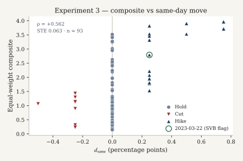

*Figure 13. Equal-weight four-dimension composite against `d_same` on scheduled non-crisis meetings (n=93). Markers are same-day actions. Spearman ρ=+0.562 (STE=0.063). Action-day ρ=+0.893 (n=30, STE=0.037). Holds stack at `d_same` = 0.*

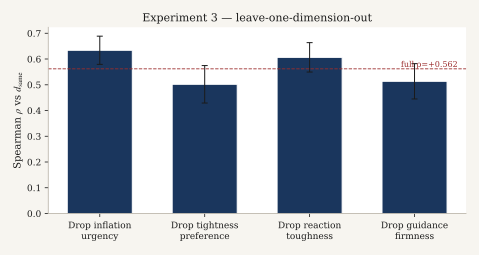

*Figure 14. Ablated composite Spearman ρ versus `d_same` (n=93), with bootstrap STE. The dashed line is the full four-dimension ρ=+0.562. Dropping `tightness_preference` or `guidance_firmness` lowers ρ; dropping `inflation_urgency` or `reaction_toughness` raises it.*

**Interpretation.** The composite is a structured absolute score, not a pairwise Choice aggregate. Concordance with `score_jev` asks whether the four-dimension rubric collapses to the main-run Score. Concordance with `d_same` and FedLock `m` places the composite in the same external comparisons as Gates 3 and 7. Ablation Δρ describes which atomic construct carries the association with the rate move; it is not a causal attribution.

**Limitations.** Equal weights are pre-specified, not estimated. Averaging assumes interval scaling of verbal rubrics. `d_same` labels policy actions, not text. Modest pooled ρ is expected under holds and is not by itself a failure of the composite.

### Experiment 4 — Multi-label Nouls

**Methods.** The same packed call returned four Nouls (yes-probability in [0, 1]): `signals_cut_soon`, `signals_higher_for_longer`, `acknowledges_banking_stress`, `blames_supply_shocks`. Eras are calendar partitions (2020; 2022 hike year; 2023-03-22 SVB; other 2023; 2024; 2025–26; residual). A multi-label case is a document with at least two Nouls ≥ 0.6.

**Results.** Mean Noul by era:

| Era | n | cut soon | higher for longer | banking stress | supply shocks |
|-----|--:|---------:|------------------:|---------------:|--------------:|
| 2020 | 9 | 0.24 | 0.05 | 0.18 | 0.20 |
| 2022_hikes | 8 | 0.03 | 0.77 | 0.04 | 0.49 |
| 2023_SVB | 1 | 0.12 | 0.61 | 0.99 | 0.08 |
| 2023_other | 7 | 0.07 | 0.89 | 0.20 | 0.07 |
| 2024 | 8 | 0.46 | 0.60 | 0.04 | 0.12 |
| 2025_26 | 14 | 0.29 | 0.44 | 0.04 | 0.62 |
| other | 48 | 0.11 | 0.13 | 0.09 | 0.37 |

On 2023-03-22, `acknowledges_banking_stress` = 0.99 (`stmt-2023-03-22`). Documents with ≥2 Nouls at or above 0.6: n=9. Pairwise Noul Spearman is in `exp4_nouls.json` (`noul_pair_spearman`).

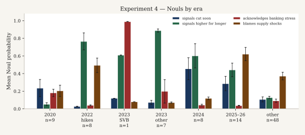

*Figure 15. Mean Noul probability by era. Error bars are STE = sd/√n from `exp4_nouls.json` era moments (undefined for the single SVB meeting). The SVB bar on banking stress is 0.99.*

**Interpretation.** Nouls are not mutually exclusive: a text may acknowledge banking stress and retain a higher-for-longer signal. Era means are descriptive. The SVB meeting is a face-validity check for `acknowledges_banking_stress`, not a causal estimate of banking-stress language.

**Limitations.** Era bins are coarse and unbalanced. Noul probabilities inherit whatever calibration the Noul primitive has; frequentist coverage is not claimed.

### Experiment 5 — Calibration / paraphrase consistency

**Methods.** Stratum A (40 extreme pairs), both orders. Baseline instructions (main-run cache): `Which of Text A or Text B is more hawkish about inflation`. Paraphrases, exact strings: (i) `Which of Text A or Text B argues for a tighter stance against inflation`; (ii) `Which of Text A or Text B is less accommodative on inflation`. Metrics: inversion versus gold; mean |p_gold,para − p_gold,baseline|; order-flip; 10-bin reliability and ECE.

**Results.** Baseline: inversion=0.000 (n=40, STE=0.000); order-flip=0.000; ECE=0.000; mean p_gold=1.000. `para_tighter_stance`: inversion=0.000; order-flip=0.000; mean |Δp|=0.000; ECE=0.000. `para_less_accommodative`: inversion=0.000; order-flip=0.000; mean |Δp|=0.00225; ECE=0.00225.

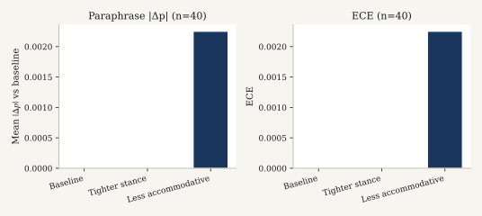

*Figure 16. Stratum A paraphrase diagnostics (n=40). Left: mean |Δp| versus the cached baseline. Right: ECE. The less-accommodative paraphrase moves mean |Δp| and ECE by 0.00225; inversion remains 0.*

**Interpretation.** Zero inversion under both paraphrases is criterion-string robustness on this rate-extreme stratum. Small |Δp| with unchanged winners is confidence stability, not a new ranking.

**Limitations.** Stratum A is constructed from rate extremes. Paraphrases were author-chosen. Baseline and paraphrase calls are not contemporaneous. Reliability bins on this stratum collapse to p=1 (all 40 pairs in the top bin).

### Experiment 6 — Evidence-span Choice

**Methods.** Fifty items (cap 50, seed 20260920): one Shah hawkish sentence as gold plus 3–5 distractors, drawn first from the same (year, doc_type) pool of neutrals and doves, otherwise from the global dove/neutral pool. Options are span ids. Instructions: `Which span is more hawkish about inflation`.

**Results.** Inversion=0.48 (n=50, STE=0.071, n_inverted=24) [0.342, 0.618]. Mean p(gold)=0.484 (STE=0.055). Option counts in the artifact: 4 options on 21 items, 5 on 20, 6 on 9. Live cost ≈ $0.00119.

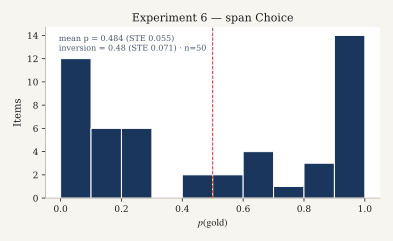

*Figure 17. Distribution of p(gold) on span items (n=50). Mean p(gold)=0.484 (STE=0.055). Inversion=0.48 (STE=0.071). Chance is 1/K given the option count (K=4, 5, or 6). Realized accuracy is 0.52.*

**Interpretation.** Span Choice asks whether the model selects a hawkish inflation sentence among local distractors. It is complementary to document-level pairwise Choice. On this design the inversion rate is near one-half.

**Limitations.** “Nearby” is same year and document type, not transcript adjacency. Distractor difficulty is uncontrolled beyond Shah label class.

### Experiment 7 — Macro-relative versus text-absolute

**Methods.** Stratum A, both orders. Absolute arm: text-only Choice with the main-run criterion (cached). Macro arm: each text is accompanied by FRED as-of values—core PCE (PCEPILFE 12-month YoY when available, else level), UNRATE, and DGS10 (VIXCLS was absent from the local dump). Instructions: `Which of Text A or Text B is more hawkish about inflation given the macro conditions provided for each text`. Gold remains the rate-extreme label.

**Results.** Macro-arm inversion=0.000 (n=40, STE=0.000). Absolute-arm inversion=0.000 (n=40, STE=0.000). Winner agreement=1.000 (n=40). Spearman of p_gold across arms is undefined (no rank variation). Mean p_gold absolute / macro = 1.000 / 0.999.

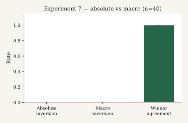

*Figure 18. Stratum A inversion under absolute and macro-conditioned instructions, and winner agreement between arms (n=40, STE=0). Both inversions are 0; agreement is 1. The estimates are at a ceiling on rate-extreme pairs. The design is not a FedLock TrueSkill replication.*

**Interpretation.** Disagreement would isolate cases where attached macro shifts the preferred text. On rate-extreme pairs the arms agree. Agreement with gold under the macro arm is a limited diagnostic: gold ignores the provided macro by construction. Experiment 7 is not Gate 7 and is not a methodological replica of FedLock.

**Limitations.** Gold is not macro-conditional. Three series only; DGS10 substitutes for VIX. As-of dates may not match real-time vintages. Extreme pairs leave little room for macro to overturn the text comparison.

### Cross-experiment notes

Suite accounting is in `results/experiments/SUMMARY.json`. Answers: `runs/jev/exp_cache/` and `runs/jev/experiments_answers.jsonl`. Gold pairs were not modified. No Haiku judge was used in Experiments 3–7.

---

### FedLock-faithful protocol replication (separate experiment)

**run_id:** `fedjev-fedlock-replica-2026-09-20`. Source: [`results/fedlock_replica/FINDINGS.md`](results/fedlock_replica/FINDINGS.md), [`agreement.json`](results/fedlock_replica/agreement.json), [`cost_performance.json`](results/fedlock_replica/cost_performance.json).

**This is not Gate 7.** Gate 7 remains Spearman agreement between the main-run BT / `score_jev` series and published FedLock `m` / `ma` under the Choice/BT protocol. The replica is a separate protocol family. Scale is 95 openings, not FedLock’s ~4,000 speeches / ~60,000 comparisons.

**Methods.** The judge task follows FedLock V3 documentation: pairwise selection of the more hawkish monetary-policy stance conditional on macroeconomic conditions attached to each text (core PCE from PCEPILFE year-over-year when computable, else level; UNRATE; real GDP growth from GDPC1 quarter-over-quarter SAAR when available, else year-over-year; VIXCLS). Texts are anonymized with `scripts/strip_meta.py`. Chair identity is not placed in judge state.

Aggregation uses Microsoft TrueSkill with priors μ₀=50, σ₀=8.33, stopping when all σ<2.0 or approximately 30 comparisons per document (global cap 2,850). Pairing is Swiss-style with uncertainty targeting. Soft probabilities update ratings by confidence-weighted outcome interpolation. Presentation order is randomized each match.

Arms: (i) TypeSafe SystemOne Choice (`jev-latest`); (ii) Claude `claude-haiku-4-5-20251001` with structured JSON winner and soft probabilities; (iii) published FedLock `press_conference` fields `m`, `ma`, `s`, `n` (Llama not re-invoked). FedLock date matching (deltas 0, +1, −1, +2 on `d`): 92 of 95 openings matched.

Protocol notes recorded in the artifact: the corpus is 95 chair openings, not FedLock’s ~4k-speech pool; VIXCLS and GDPC1 were added to `data/raw/fred/` for this run; one Haiku comparison failed JSON parse mid-tournament (round continued with 46 pairs); both arms stopped on all σ<2.0 (about 22 comparisons per document), below the 30/document and 2,850 global caps.

**Results — rank agreement** (bootstrap STE, 1,000 resamples; from `agreement.json`):

| Contrast | Spearman ρ (STE) [95% CI] | Kendall τ (STE) [95% CI] | n |
|----------|---------------------------|--------------------------|--:|
| Jev↔Haiku | +0.955 (0.012) [+0.923, +0.971] | +0.830 (0.023) [+0.784, +0.873] | 95 |
| Jev↔FedLock `m` | +0.965 (0.011) [+0.934, +0.978] | +0.850 (0.021) [+0.806, +0.888] | 92 |
| Jev↔FedLock `ma` | +0.790 (0.044) [+0.681, +0.853] | +0.576 (0.043) [+0.492, +0.658] | 92 |
| Haiku↔FedLock `m` | +0.945 (0.013) [+0.910, +0.962] | +0.798 (0.023) [+0.753, +0.841] | 92 |
| Haiku↔FedLock `ma` | +0.768 (0.042) [+0.666, +0.828] | +0.550 (0.042) [+0.463, +0.629] | 92 |

**Results — listed cost and latency** (from `cost_performance.json` / FINDINGS):

| Arm | n comps | input tok | output tok | USD | USD/MTok eff. | USD/comp | latency mean / p50 / p95 (ms) | comps/s |
|-----|--------:|----------:|-----------:|----:|--------------:|---------:|------------------------------:|--------:|
| Jev | 1,034 | 3,376,150 | 28,768 | 0.1418 | 0.0416 | 0.000137 | 283 / 271 / 419 | 22.978 |
| Haiku | 1,033 | 3,347,688 | 48,412 | 3.5897 | 1.0570 | 0.003475 | 732 / 687 / 988 | 8.156 |

Jev stop: `all_sigma_lt_2`; max σ=1.986; fraction σ<2=1.000. Haiku stop: `all_sigma_lt_2`; max σ=1.965; fraction σ<2=1.000. Listed prices used in the artifact: Jev $0.042/MTok input, output free; Haiku $1.0/MTok input, $5.0/MTok output.

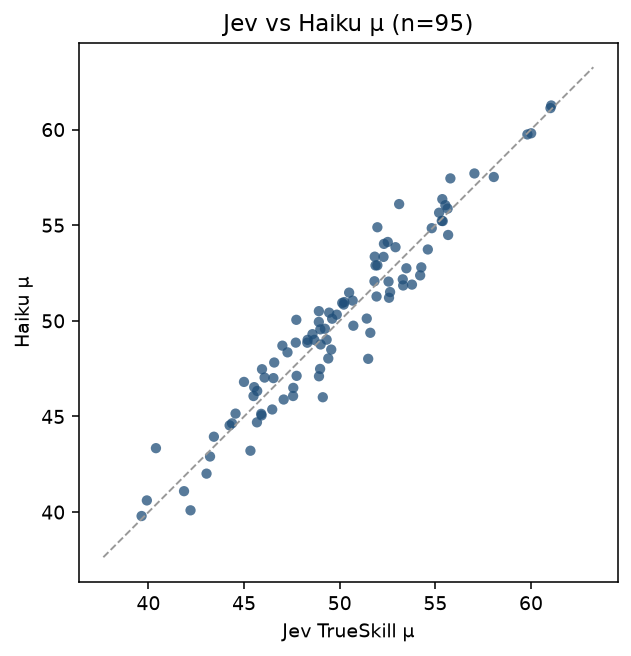

*Figure 19. TrueSkill μ, Jev versus Haiku, on the 95 openings (`fedjev-fedlock-replica-2026-09-20`). Spearman ρ=+0.955 (STE=0.012, n=95). This is cross-judge agreement under a shared macro-conditioned protocol, not Gate 7.*

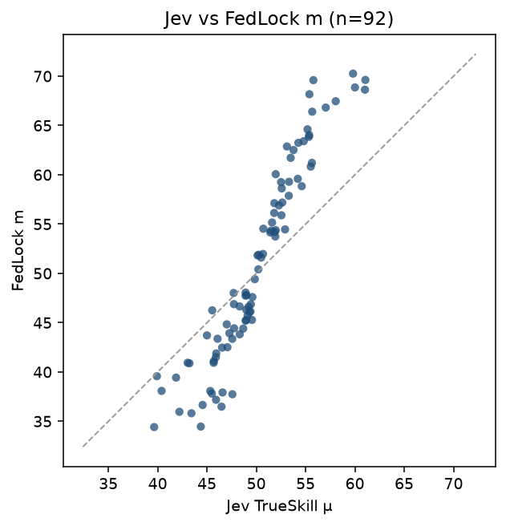

*Figure 20. Jev TrueSkill μ versus published FedLock raw `m` on matched meetings (n=92). Spearman ρ=+0.965 (STE=0.011). The FedLock series is the published Llama score, not a re-run of Llama.*

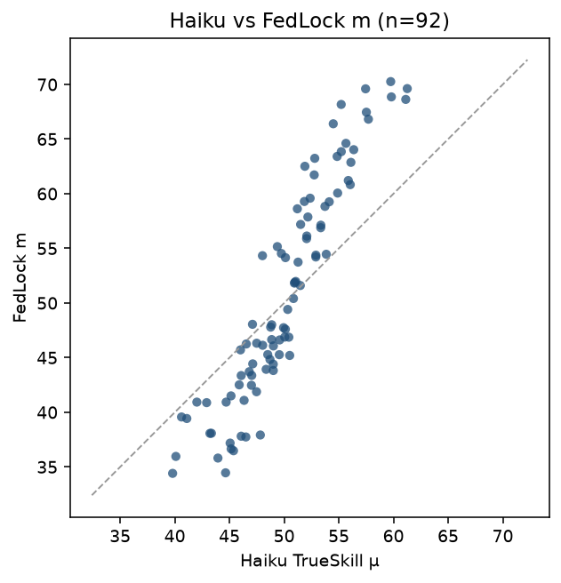

*Figure 21. Haiku TrueSkill μ versus published FedLock raw `m` (n=92). Spearman ρ=+0.945 (STE=0.013).*

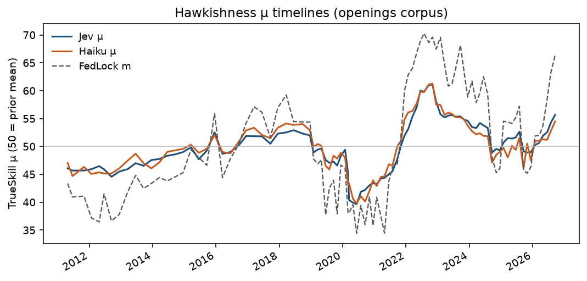

*Figure 22. TrueSkill μ by meeting date for the Jev and Haiku arms (n=95 openings). The series are protocol-replica ratings, not the main-run BT / `score_jev` gates.*

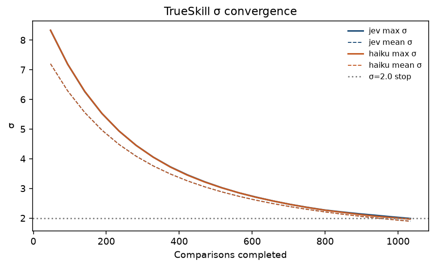

*Figure 23. TrueSkill σ paths. Both arms stopped on all σ<2.0 (Jev max σ=1.986; Haiku max σ=1.965; fraction σ<2=1.000). Mean comparisons per document are about 22, below the 30/document cap.*

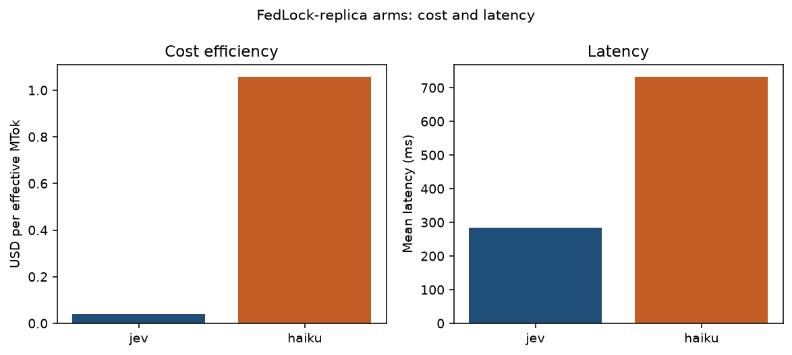

*Figure 24. Listed USD and mean latency for the replica arms. Jev: $0.1418, 1,034 comparisons, mean 283 ms. Haiku: $3.5897, 1,033 comparisons, mean 732 ms. These axes are accounting facts, not accuracy claims.*

**Interpretation.** Concordance between Jev and Haiku under a shared FedLock-style protocol measures cross-judge stability of relative hawkishness on this openings sample. Concordance with published FedLock `m` / `ma` asks whether the same protocol family, applied to chair openings rather than FedLock’s broader speech corpus and Llama 3.3 70B judge, recovers a similar ordering of meeting-day stance. Era-adjusted `ma` removes quarterly means; the weaker `ma` contrasts partly reflect era composition of the 2011–2026 openings window. Cost and latency are not gate criteria.

**Limitations.** Scale is 95 openings with a 2,850-comparison cap, not ~60,000 comparisons on ~4,000 speeches. Openings are a subset of press-conference communication; FedLock `press_conference` scores may reflect fuller transcripts. Published FedLock scores use Llama 3.3 70B; this replica uses Jev and Haiku, so agreement with `m`/`ma` mixes protocol fidelity and model differences. Soft TrueSkill via outcome interpolation is an approximation to confidence-weighted updates, not a bit-exact unpublished kernel. FRED series are as-of speech date from the local dump (plus downloaded VIXCLS/GDPC1); real-time vintages differ. These limitations do not change the Gate 7 fidelity statement.

---

## Discussion

**Construct validity (Gate 1).** Zero inversion on Stratum A indicates that, under the fixed criterion and dual-order protocol, the ranking recovers rate-extreme hawk-versus-dove document orderings.

**Rank agreement on action days (Gate 3).** BT ranks track `d_same` on scheduled action days above the pre-registered +0.30 line and above the jsort +0.46 published point estimate. Bootstrap intervals exclude zero. This is rank agreement with a behavioral label, not identification of a policy-rule residual.

**Incomplete behavioral labels under holds (Gate 4).** When the target is unchanged, `d_same` cannot distinguish hawkish-hold from dovish-hold text. Higher mean text scores on holds than on cuts are informative about the textual construct where the behavioral label is uninformative. Same-day funds-rate changes are therefore an incomplete label for textual hawkishness under holds.

**External consistency (Gate 7).** Jev scores agree with an independent FedLock text score, more so for the Score pass versus raw `m` than versus era-adjusted `ma`. Combined with the fidelity statement under Results, this is agreement between two text measures. It is not a TrueSkill or macro-conditioned replication.

**Separate protocol replica.** Under a FedLock-style TrueSkill and macro-conditioned pairing on the 95 openings, Jev μ agrees with Haiku μ (Spearman +0.955, STE=0.012, n=95) and with published FedLock `m` (Spearman +0.965, STE=0.011, n=92). That run does not replace Gate 7 and is not a 4,000-speech scale replication.

---

## Limitations

The BT graph is sparse (48 statements, 124 comparisons). The dissent scrape is incomplete, so hold-day dissent correlations are noisy. Chair openings are not full press conferences. The evaluation uses a single criterion string and a single model version on the main gates (`jev-1.13.0`); Experiments 3–7 use `jev-latest`. The Gate 4 BT gap interval includes zero. Experiments 3–7 do not re-identify the hold-day labeling wedge. Span Choice (Experiment 6) is near chance on this distractor design. Macro conditioning (Experiment 7) does not overturn rate-extreme gold on Stratum A.

---

## Reproducibility

```bash
git clone https://github.com/maybern-tripp-smith/fedjev-bench
cd fedjev-bench
python -m venv .venv && source .venv/bin/activate
pip install typesafe-sdk pandas pyarrow openpyxl scipy matplotlib
export TYPESAFE_API_KEY=...   # never commit
python score.py --live --full
python scripts/run_name_ablation.py --live
python scripts/analyze_gates.py
python scripts/plot_figures.py
python scripts/run_experiments_3_7.py   # optional: Experiments 3–7
```

Frozen inputs: `data/pairs/gold_pairs.jsonl`, `data/clean/`, `data/labels/`. Outputs: `results/`, `runs/jev/`. Cached answers under `runs/jev/` permit offline re-analysis via `python scripts/analyze_gates.py`. Experiment suite: `results/experiments/`. Figures: `python scripts/plot_figures.py` writes SVG/PNG to `results/figures/` and `docs/figures/`.

## Licenses

| Asset | Status |
|-------|--------|
| Code | MIT |
| FOMC openings | U.S. government works; cite federalreserve.gov; no Federal Reserve endorsement |
| FRED | St. Louis Fed terms |
| Shah | CC BY-NC 4.0 — attribution; non-commercial; full dump not vendored |
| jsort | MIT |
| FedLock | Upstream site terms; snapshot for Gate 7 only |

Research instrumentation only. Not investment advice.

## Citation

See [`CITATION`](CITATION).
