# Textual hawkishness of FOMC chair openings

**run_id:** `fedjev-2026-09-20`  
**model:** jev-1.13.0 (TypeSafe SystemOne)  
**criterion (exact):** `more hawkish about inflation`  
**repository:** [maybern-tripp-smith/fedjev-bench](https://github.com/maybern-tripp-smith/fedjev-bench)  
**pages:** [https://maybern-tripp-smith.github.io/fedjev-bench/](https://maybern-tripp-smith.github.io/fedjev-bench/)

Companion gate tables: [`REPORT.md`](REPORT.md). Machine-readable estimates: [`results/gates.json`](results/gates.json). Estimator glossary: [`results/interpretation.json`](results/interpretation.json). FedLock matching and fidelity: [`results/fedlock_fidelity.md`](results/fedlock_fidelity.md).

---

## Abstract

Same-day changes in the federal funds target are a convenient but incomplete label for the hawkishness of Federal Open Market Committee (FOMC) communication. Policy actions and textual stance often co-move on scheduled action days. They need not coincide when the Committee leaves the target unchanged.

This note reports a pre-registered evaluation of TypeSafe/Jev on chair press-conference openings. The protocol is pairwise Choice under the fixed criterion string `more hawkish about inflation`, presented in both orders, aggregated by Bradley–Terry (BT), with a secondary direct Score pass. Seven gates examine construct validity on easy pairs, rank agreement with same-day target moves, separation of holds from cuts on the text axis, forward-path correlation, order and name stability, and external consistency with an independent text score (FedLock).

Primary quantities are reported with standard errors (STE) and, where applicable, bootstrap percentile confidence intervals. Gate 4 is a construct-validity result: when the target is unchanged, `d_same` is identically zero and cannot encode hawkish- versus dovish-hold language. Gate 7 is Spearman agreement with FedLock raw (`m`) and era-adjusted (`ma`) scores. It is not a TrueSkill or macro-conditioned methodological replication.

---

## 1. Introduction

Work on FOMC language often treats the realized same-day target-rate change as a proxy for how hawkish a communication was. That proxy mixes two constructs, defined once here and used throughout.

The **behavioral measure** is the Committee’s voted action. The series used below is `d_same`, the same-day change in the funds target (hike, hold, or cut), together with dissent counts where available.

The **textual measure** is the stance expressed in the Chair’s opening remarks about inflation, the labor market, and the policy path, recovered under a fixed pairwise criterion.

On scheduled action days the two series frequently align. On holds (`d_same = 0`), and across regimes—for example 2020 easing communications versus 2022–23 holds with hawkish inflation language—alignment is not guaranteed. The evaluation therefore asks three measurement questions.

First, under a fixed pairwise criterion, does the ranking recover obvious hawk-versus-dove document orderings? Second, on scheduled action days, does it agree in rank with `d_same`? Third, on the text axis, do holds sit above cuts—as would be expected if same-day funds-rate changes are an incomplete label for textual hawkishness when the target is unchanged?

Gates were registered before any Jev output. Pass/fail applies to Gates 1, 3, 4, and 6. Gates 2, 5, and 7 are report-only or secondary.

The note is a measurement exercise. It does not identify a causal effect of communication on rates, markets, or subsequent policy.

---

## 2. Related work

| Work | Contribution | Use in this evaluation |
|------|--------------|------------------------|
| **jsort** ([keltokhy/jsort](https://github.com/keltokhy/jsort)) | Statement ranking; published Spearman versus same-day move ≈ **+0.46** | Label formulas (`d_same`, `d_90`, `d_2y`); Gate 3 signal line (+0.30) and published reference (+0.46) |
| **Shah et al.** ([gtfintechlab/fomc-hawkish-dovish](https://github.com/gtfintechlab/fomc-hawkish-dovish); CC BY-NC 4.0) | Sentence-level hawk/dove/neutral labels | Stratum B; Gate 2 report-only |
| **FedLock** ([jnathan9.github.io/fedlock](https://jnathan9.github.io/fedlock/)) | Independent LLM pairwise tournament with TrueSkill scores | Gate 7 external consistency (report-only); see §6 |

jsort supplies the behavioral-label algebra and a published rank-correlation reference. Shah supplies sentence gold for a stress test that is not used to pass or fail the document-level claim. FedLock supplies an independent meeting-day text score. None of these sources is treated as a ground-truth hawkishness index.

---

## 3. Data

| Corpus | Path | Role |
|--------|------|------|
| Chair press-conference openings | `data/clean/statements.jsonl` (~95 documents) | Document-level Choice and Score |
| Shah sentences | `data/clean/sentences.jsonl` | Stratum B |
| Meeting calendar and FRED labels | `data/labels/meetings.parquet` | `d_same`, `d_90`, `d_2y`, dissent counts, exclusions |
| FedLock snapshot | `data/raw/fedlock/data.json` | Gate 7 (`m`, `ma`, `s`, `st`) |
| FRED CSVs | `data/raw/fred/` | DFEDTARU, DGS2 |

**Labels (jsort-aligned).** `d_same` = DFEDTARU[t+1] − DFEDTARU[t−1]. `y_action` = sign(`d_same`). `d_90` = DFEDTARU[t+90] − DFEDTARU[t]. `d_2y` = DGS2[t] − DGS2[t−1].

**Exclusions (pre-registered).** Drop 2020-03-03 and 2020-03-15 (unscheduled) and other `exclude_main` or unscheduled rows from the main analysis. Flag 2023-03-22 (SVB) without dropping.

**Gold strata (frozen before scoring).** A, extreme document pairs, n=40. B, Shah hawk versus dove sentences, n=200, seed 20260920. C, adjacent scheduled meetings with nonzero change in `d_same`, n=22. Manifest: `data/pairs/PAIR_MANIFEST.md`.

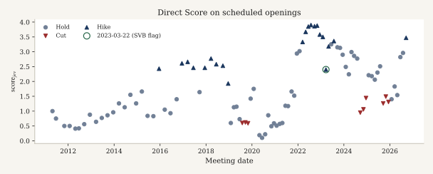

*Figure 1. Direct Score (`score_jev`) on scheduled openings in the main sample (crisis dates dropped; n=93). Marker shape is the same-day action: hike, hold, or cut. The teal circle marks 2023-03-22 (SVB), which is flagged and retained. Holds sit at a wide range of text scores even though `d_same` is zero.*

---

## 4. Measurement

**Choice (primary).** Criterion string: `more hawkish about inflation`. Each gold pair is presented in both orders (`ab` and `ba`). Choice probabilities are mapped to the gold side and averaged. An inversion is an averaged winner that does not match gold. Chair names and ISO dates are stripped (`scripts/strip_meta.py`).

**Score (secondary).** A five-level ordinal rating is mapped to a continuous `score_jev` for each opening.

**Bradley–Terry.** BT scores use Strata A and C Choice probabilities. Shah pairs are excluded because they are sentence-level. This run: n_statements=**48**, n_comparisons=**124**, converged=True, position bias γ=**-0.1378**. The comparison graph is sparse. The BT `se` in `statement_scores.csv` is fit uncertainty from the pairwise likelihood, not a meeting-sampling STE.

**Uncertainty.** Spearman: bootstrap STE (standard deviation of 1,000 meeting resamples) and percentile 95 percent confidence interval. Inversion: binomial STE √[p(1−p)/n]. Means and Brier scores: STE = sd/√n. Gate 4 gap STE = √(ste_holds² + ste_cuts²).

---

## 5. Pre-registered gates and results

| # | Gate | Pass line | Result |
|---|------|-----------|--------|
| 1 | Easy-pair inversion (A) | ≤ 0.05 | **PASS** — rate=0.0000 (n=40, STE=0.0000) |
| 2 | Sentence discrimination (B) | report | inv=0.1900 STE=0.0277; Brier=0.1384 STE=0.0156 (n=200) |
| 3 | Action ranking | Spearman ≥ +0.30 | **PASS** — BT all=+0.623 (n=46, STE=0.096) [+0.398, +0.787]; action=+0.851 (n=24, STE=0.074) [+0.652, +0.937] |
| 4 | Holds versus cuts | mean(holds) > mean(cuts) | **PASS** — BT gap=+0.519 STE=0.368 (n_h=22, n_c=8) |
| 5 | Forward path (`d_90`) | secondary | BT=+0.357 (n=44, STE=0.154) [+0.042, +0.627]; score_jev=+0.511 (n=91, STE=0.081) [+0.336, +0.652] |
| 6 | Order/name stability | Δ inv ≤ 0.05 | **PASS** — Δ=0.0000 |
| 7 | FedLock consistency | report | BT vs m=+0.679 (n=46, STE=0.112) [+0.436, +0.861]; vs ma=+0.594 (n=46, STE=0.104) [+0.361, +0.770]; score_jev vs m=+0.944 (n=90, STE=0.016) [+0.900, +0.966]; vs ma=+0.774 (n=90, STE=0.044) [+0.673, +0.839] |

### 5.1 Inversion by stratum

| Stratum | n | inverted | inversion (STE) | mean p(gold) | mean Brier (STE) | order-flip |
|---------|--:|--------:|----------------:|-------------:|-----------------:|-----------:|
| A extreme | 40 | 0 | 0.000 (0.000) | 1.000 | 0.000 (0.000) | 0.000 |
| B Shah | 200 | 38 | 0.190 (0.028) | 0.745 | 0.138 (0.016) | 0.105 |
| C adjacent | 22 | 1 | 0.045 (0.044) | 0.855 | 0.046 (0.018) | 0.091 |

Stratum A has no inversions. The inverted adjacent pair is **C018**. Gate 2 (19 percent inversion) is a sentence-level stress test. It is not a pass/fail of the document-level claim.

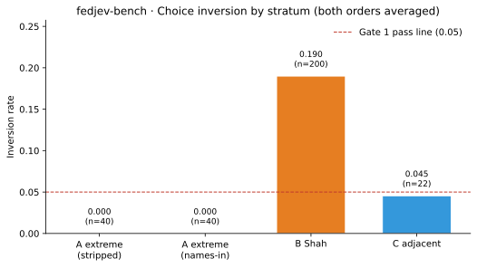

*Figure 2. Inversion rate by gold stratum, Jev versus Haiku 4.5 under the same pairs and criterion. Error bars are binomial STE √[p(1−p)/n]. The dashed line is the Gate 1 pass line (0.05). Stratum A is zero for both models (n=40, STE=0). Stratum B: Jev 0.190 (STE 0.028, n=200); Haiku 0.170 (n=200). Stratum C: 0.045 (STE 0.044, n=22) for both.*

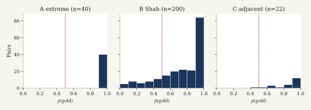

*Figure 3. Distribution of averaged two-order p(gold) by stratum. The dashed line is 0.5. Stratum A is a point mass at 1.0 (n=40). Stratum B (n=200) has interior probabilities. Stratum C (n=22) is concentrated above 0.5.*

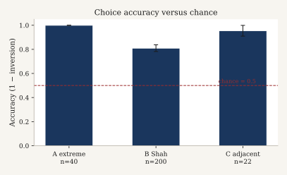

*Figure 4. Choice accuracy (1 − inversion) versus a 0.5 chance line. Error bars are the binomial STE of the inversion rate. A: 1.000 (n=40). B: 0.810 (STE 0.028, n=200). C: 0.955 (STE 0.044, n=22).*

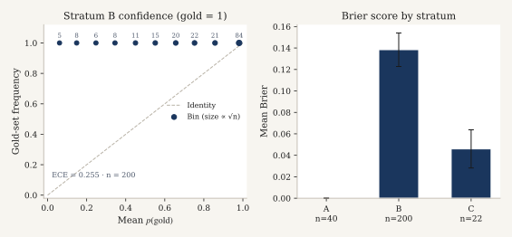

*Figure 5. Left: Stratum B confidence diagnostic. Gold-pair frequency is identically 1 by construction of the gold set, so the panel plots bin-mean p(gold) against 1. ECE is the bin-weighted |1 − p̄| = 0.255 (n=200). This is not a reliability curve versus an independent outcome; inversion is a function of the same p. Right: mean Brier ± STE. A: 0.000 (n=40). B: 0.138 (STE 0.016, n=200). C: 0.046 (STE 0.018, n=22). A separate paraphrase-|Δp| series is not in the repository.*

### 5.2 Gate 3 — rank agreement with policy actions

| Slice | BT Spearman ρ [STE; 95% CI] | n |
|-------|------------------------------|--:|
| All scheduled (excl. crisis) | +0.623 (n=46, STE=0.096) [+0.398, +0.787] | 46 |
| action_days (`d_same`≠0) | +0.851 (n=24, STE=0.074) [+0.652, +0.937] | 24 |
| hold_days vs (n_hawk−n_dove) | −0.192 (n=22, STE=0.202) [−0.513, +0.274] | 22 |
| hold_days vs `d_2y` | −0.135 (n=22, STE=0.244) [−0.594, +0.349] | 22 |

Secondary `score_jev`: all=+0.589 (n=93, STE=0.063) [+0.460, +0.701]; action=+0.918 (n=30, STE=0.033) [+0.812, +0.953].

Action-day ρ exceeds all-scheduled ρ because holds contribute no variation in `d_same`. Spearman versus `d_same` on holds alone is undefined and is not computed. Hold-day associations with net dissents and `d_2y` are weak. That pattern is consistent with holds mixing hawkish-hold and dovish-hold communications.

The jsort published reference is Spearman ≈ +0.46 (STE not re-estimated here). BT action-day ρ=+0.851 (STE=0.074) exceeds both the pre-registered +0.30 line and that published point estimate. Bootstrap intervals on the action-day and all-scheduled slices exclude zero.

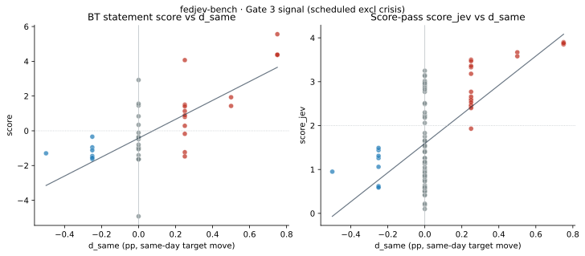

*Figure 6. Meeting-level text scores against `d_same` on scheduled meetings excluding unscheduled crisis dates. Left: Bradley–Terry (n=46). Right: `score_jev` (n=93). Triangles are action days; circles are holds (`d_same` = 0). The teal outline is 2023-03-22 (SVB). Spearman ρ and bootstrap STE are the Gate 3 all-scheduled estimates. Holds form a vertical stack because the behavioral label does not vary.*

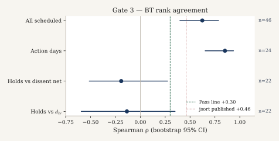

*Figure 7. BT Spearman ρ with bootstrap percentile 95 percent intervals. All scheduled: +0.623 (n=46, STE=0.096). Action days: +0.851 (n=24, STE=0.074). Hold-day contrasts versus dissent net and `d_2y` have intervals that include zero. Vertical lines mark the pre-registered +0.30 pass line and the jsort published point estimate +0.46.*

### 5.3 Gate 4 — holds versus cuts on the text axis

| Score | mean holds (STE, n) | mean cuts (STE, n) | mean hikes (STE, n) | gap holds−cuts (STE) |
|-------|---------------------|--------------------|---------------------|----------------------|
| BT | −0.720 (0.335, 22) | −1.239 (0.153, 8) | 1.827 (0.532, 16) | +0.519 (0.368) |
| score_jev | 1.457 (0.114, 63) | 1.036 (0.122, 9) | 3.067 (0.135, 21) | +0.421 (0.167) |

Under holds, `d_same` is identically zero. It therefore cannot encode hawkish- versus dovish-hold communications. A higher mean text score on holds than on cuts indicates that the textual measure separates these regimes where the same-day behavioral label cannot.

This is a construct-validity result: same-day funds-rate changes are an incomplete label for textual hawkishness when the target is unchanged. It is not a claim that text overrides the voted action, nor a judgment of policy correctness.

The BT gap 95 percent interval includes zero ([−0.202, +1.239]). The `score_jev` gap interval does not ([+0.094, +0.749]). The pre-registered pass rule is the point comparison mean(holds) > mean(cuts).

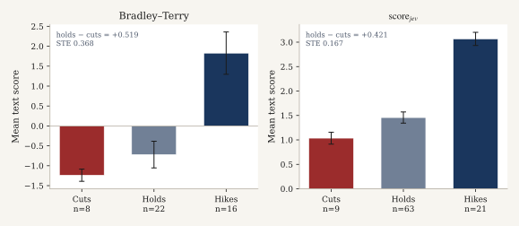

*Figure 8. Mean text scores by same-day action, ± STE (sd/√n). Left, BT: cuts −1.239 (STE 0.153, n=8); holds −0.720 (STE 0.335, n=22); hikes +1.827 (STE 0.532, n=16); holds−cuts gap +0.519 (STE 0.368). Right, `score_jev`: cuts 1.036 (STE 0.122, n=9); holds 1.457 (STE 0.114, n=63); hikes 3.067 (STE 0.135, n=21); gap +0.421 (STE 0.167). Holds sit above cuts on both scales.*

### 5.5 Gate 5 — forward path

BT versus `d_90`: +0.357 (n=44, STE=0.154) [+0.042, +0.627]. `score_jev` versus `d_90`: +0.511 (n=91, STE=0.081) [+0.336, +0.652]. The gate is secondary.

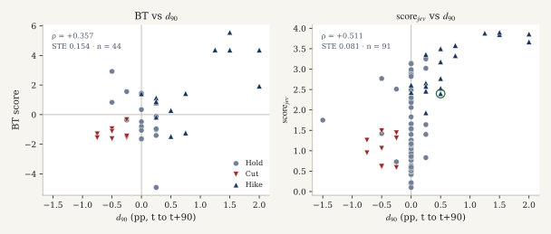

*Figure 9. Text scores against the 90-day subsequent change in the funds target (`d_90`). Markers follow the same-day action, not the forward path. Left: BT, n=44. Right: `score_jev`, n=91. Spearman ρ and bootstrap STE are the Gate 5 estimates. Intervals exclude zero on both slices.*

### 5.4 Gate 6 — name ablation

Baseline inversion (names stripped) = 0.0000. Names left in = 0.0000. Δ = 0.0000 ≤ 0.05 (**PASS**). Add-on cost $0.010955 (80 calls).

Openings rarely embed Chair names or ISO dates that the stripper can remove. The zero delta is therefore more informative about order stability than about name confounding.

---

## 6. Relationship to FedLock

Full note: [`results/fedlock_fidelity.md`](results/fedlock_fidelity.md).

FedLock V3 ([methodology](https://jnathan9.github.io/fedlock/)) is a pairwise tournament with Llama 3.3 70B on anonymized speeches. The judge prompt includes macro context (core PCE, unemployment, GDP growth, VIX). Scores are aggregated by TrueSkill (μ₀=50, σ₀≈8.33, target σ<2) over roughly 60,000 comparisons and 4,000 speeches. Published fields include `m` (raw μ), `ma` (era-adjusted), `s` (σ), `n`, and `st`.

**Shared with this evaluation.** Pairwise textual hawkishness as the object of measurement. Name and meta stripping on the Jev Choice calls. Use of FedLock `press_conference` scores as an external consistency check.

**Not reproduced.** Macro-conditioned judge prompts. TrueSkill. Era adjustment as the Gate 7 primary (`ma` is reported as a sensitivity). The full speech corpus. The Llama judge. Swiss or uncertainty-targeted matching.

Gate 7 ρ is therefore agreement between two independent text-scoring systems on meeting-day hawkishness. It is not a methodological replication of FedLock.

**Matching.** Prefer the meeting date embedded in the FedLock title; otherwise the FedLock `d` field with deltas 0, +1, −1, +2. Matched meetings=92; main-analysis matched=90; same-calendar-day on the `d` field=1; delta distribution={'0': 1, '1': 89}; match-via={'title_date': 90}; mean FedLock `s` on the matched main set=1.7762.

| Contrast | ρ | STE | n | 95% CI |
|----------|--:|----:|--:|--------|
| BT vs `m` | +0.679 | 0.112 | 46 | [+0.436, +0.861] |
| BT vs `ma` | +0.594 | 0.104 | 46 | [+0.361, +0.770] |
| score_jev vs `m` | +0.944 | 0.016 | 90 | [+0.900, +0.966] |
| score_jev vs `ma` | +0.774 | 0.044 | 90 | [+0.673, +0.839] |

Agreement with raw `m` is stronger than with era-adjusted `ma`, especially for `score_jev`. The corpora differ: chair openings are not necessarily full FedLock press-conference transcripts.

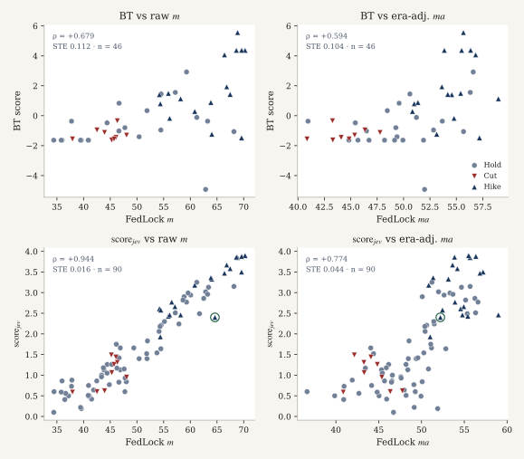

*Figure 10. Meeting-level Jev scores against FedLock `press_conference` scores, main-analysis match (title date preferred). Top: BT versus raw `m` and era-adjusted `ma` (n=46). Bottom: `score_jev` versus `m` and `ma` (n=90). Markers are same-day actions. ρ and bootstrap STE match Gate 7. The teal outline is 2023-03-22. This is agreement with an independent text score, not a TrueSkill or macro-conditioned replication.*

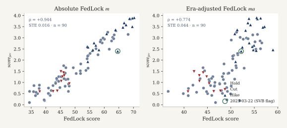

*Figure 11. The same `score_jev` series against FedLock raw `m` (left; ρ=+0.944, STE=0.016, n=90) and era-adjusted `ma` (right; ρ=+0.774, STE=0.044, n=90). The raw contrast is near a rank ceiling. Experiment 7 (a separate macro-relative scoring design) is not in the repository; the panel uses the Gate 7 series that are.*

---

## 7. How to read the estimates

| Quantity | Meaning in this note |
|----------|----------------------|
| Spearman ρ vs `d_same` | Rank agreement between meeting-level text hawkishness and the same-day target move |
| Why action-day ρ exceeds all-scheduled ρ | Holds add no `d_same` variation and dilute the pooled correlation |
| Hold-day ρ vs `d_same` | Undefined; not computed (`d_same` is constant 0) |
| Gate 4 gap | Mean text score(holds) − mean text score(cuts) |
| Inversion 0 on Stratum A | Averaged two-order winner matched gold on easy pairs. Does not imply calibration on hard pairs or policy forecasting |
| BT `se` | Uncertainty from the pairwise BT likelihood, not a bootstrap over meetings |
| Haiku versus Jev | Winner agreement (inversion) is the accuracy comparison. Listed USD and per-call latency are separate axes |
| STE | Standard error as defined in §4 for each estimator family |

---

## 8. Implementation cost and latency

List price for jev-1.13.0 in this run: **$0.042 per million input tokens**; output free. Main run ≈ **$0.03120** (619 calls; 524 Choice + 95 Score). Name-ablation add-on ≈ $0.011. Grand total ≈ **$0.042**. Mean per-call latency ≈ 214 ms at concurrency 6. Approximate wall time under perfect parallelism is sum/6 (~22 s). See `results/cost.json` and `results/timing.json`.

### Same-protocol Choice comparison (Claude Haiku 4.5)

| | Jev 1.13.0 | Haiku 4.5 |
|--|------------|-----------|
| Stratum A / C inversion | 0.000 / 0.045 | 0.000 / 0.045 |
| Stratum B inversion | 0.190 | 0.170 |
| Choice USD | ≈ $0.024 | ≈ $0.636 (~27×) |
| Mean latency | ≈ 207 ms | ≈ 676 ms (~3.3×) |

On Strata A and C the inversion rates are identical. On Shah, Haiku inversion is 0.170 versus 0.190 for Jev, with a higher Haiku order-flip rate (0.24 versus 0.105). Winner agreement is the primary accuracy comparison. Listed cost and latency are reported separately and are not used as gate criteria.

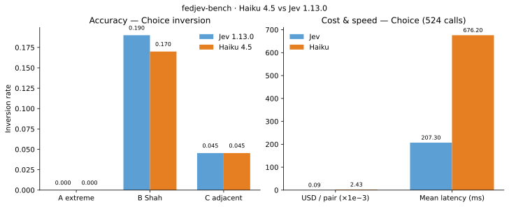

*Figure 12. Same-protocol Choice arm (524 calls). Left: listed USD (Jev ≈ $0.024; Haiku ≈ $0.636). Right: mean per-call latency (Jev ≈ 207 ms; Haiku ≈ 676 ms). These axes are not gate criteria.*

---

## 9. Interpretation and limitations

**Construct validity (Gate 1).** Zero inversion on Stratum A indicates that, under the fixed criterion and dual-order protocol, the ranking recovers obvious hawk-versus-dove document orderings.

**Rank agreement on action days (Gate 3).** BT ranks track `d_same` on scheduled action days above the pre-registered +0.30 line and above the jsort +0.46 published point estimate. Bootstrap intervals exclude zero. This is rank agreement with a behavioral label, not identification of a policy-rule residual.

**Incomplete behavioral labels under holds (Gate 4).** When the target is unchanged, `d_same` cannot distinguish hawkish-hold from dovish-hold text. Higher mean text scores on holds than on cuts are informative about the textual construct where the behavioral label is uninformative. Same-day funds-rate changes are therefore an incomplete label for textual hawkishness under holds.

**External consistency (Gate 7).** Jev scores agree with an independent FedLock text score, more so for the Score pass versus raw `m` than versus era-adjusted `ma`. Combined with the fidelity statement in §6, this is agreement between two text measures. It is not a TrueSkill or macro-conditioned replication.

**Limitations.** The BT graph is sparse (48 statements, 124 comparisons). The dissent scrape is incomplete, so hold-day dissent correlations are noisy. Chair openings are not full press conferences. The evaluation uses a single criterion string and a single model version. The Gate 4 BT gap interval includes zero. Follow-on designs listed in §11 are not estimated in this run.

---

## 10. Reproducibility

```bash
git clone https://github.com/maybern-tripp-smith/fedjev-bench
cd fedjev-bench
python -m venv .venv && source .venv/bin/activate
pip install typesafe-sdk pandas pyarrow openpyxl scipy matplotlib
export TYPESAFE_API_KEY=...   # never commit
python score.py --live --full
python scripts/run_name_ablation.py --live
python scripts/analyze_gates.py
python scripts/plot_figures.py
```

Frozen inputs: `data/pairs/gold_pairs.jsonl`, `data/clean/`, `data/labels/`. Outputs: `results/`, `runs/jev/`. Cached answers under `runs/jev/` permit offline re-analysis via `python scripts/analyze_gates.py`. Figures: `python scripts/plot_figures.py` writes SVG/PNG to `results/figures/` and `docs/figures/`.

---

## 11. Additional Jev primitives (experiments 3–7)

These runs exercise typed System One primitives that the pairwise Choice gate set does not use. They are exploratory relative to the pre-registered gates; estimates include STE where reported in `results/experiments/`.

**run_id:** `fedjev-2026-09-20`  
**model:** `jev-latest` (TypeSafe SystemOne; resolved model ids logged per call)  
**criterion family:** inflation / hawkishness  
**cost (this experiment suite):** $0.04453 over 385 logical calls (0 cache hits; 1060179 input tokens at $0.042/MTok input).

This section reports five follow-up probes that hold the corpus, gold pairs, and primary criterion family fixed while varying the question interface (multi-Score composite, multi-label Noul, paraphrase Choice, span Choice, and macro-conditioned Choice). Gold labels are unchanged: Stratum A extremes remain rate-path constructed; document-level `d_same` remains the FRED same-day funds-target move. All live calls use `jev-latest` via `typesafe-sdk`; answers are cached under `runs/jev/exp_cache/`.

---

### Experiment 3 — Composite atomic Scores

#### Methods

For each of 95 presser-opening statements (meta-stripped), a single SystemOne request elicited four ordered Scores (levels 0–4) jointly with the Exp4 Nouls (cost sharing). Dimensions and equal weights:

| Dimension | Weight | Construct |
|-----------|-------:|-----------|
| `inflation_urgency` | 0.25 | Urgency of the inflation fight |
| `tightness_preference` | 0.25 | Preference for tighter policy |
| `reaction_toughness` | 0.25 | Toughness of reaction function / willingness to accept growth pain |
| `guidance_firmness` | 0.25 | Firmness of forward guidance / higher-for-longer tone |

Composite = equal-weight mean of the four scores ($w_d = 1/4$). Correlations use Spearman rho with bootstrap STE (1,000 resamples, seed 20260920) on scheduled, non-excluded, non-crisis meetings (n=93). Ablation drops one dimension and re-averages the remaining three with equal weight.

#### Results

- Composite vs `d_same`: rho=0.562 (n=93, STE=0.063)
- Composite vs `d_same` (action days only): rho=0.893 (n=30, STE=0.037)
- Composite vs existing `score_jev`: rho=0.962 (n=93, STE=0.010)
- Composite vs FedLock press-conference `m` (meeting±1d match): rho=0.957 (n=90, STE=0.012)

Leave-one-dimension-out (Delta-rho vs full composite on `d_same`):

- Drop `inflation_urgency`: rho=0.634 (n=93, STE=0.055); Delta-rho vs full = 0.072
- Drop `tightness_preference`: rho=0.502 (n=93, STE=0.073); Delta-rho vs full = -0.060
- Drop `reaction_toughness`: rho=0.607 (n=93, STE=0.057); Delta-rho vs full = 0.045
- Drop `guidance_firmness`: rho=0.513 (n=93, STE=0.069); Delta-rho vs full = -0.048

Artifacts: `results/experiments/exp3_composite.json`, `exp3_composite.csv`.

#### Interpretation

The four-way composite is a structured absolute score of communicated stance, not a pairwise Choice aggregate. Concordance with `score_jev` tests whether the richer rubric collapses to the single hawkishness Score used in the main run; concordance with `d_same` and FedLock `m` situates the composite in the same external comparisons as Gates 3 and 7. Ablation Delta-rho identifies which atomic construct carries most of the association with the rate move.

#### Limitations

Equal weights are a pre-specified convenience, not estimated from data. Score levels are verbal rubrics whose interval scaling is assumed when averaging. `d_same` labels policy outcomes, not text; holds can be text-hawkish, so modest rho is expected and is not by itself a failure of the composite.

---

### Experiment 4 — Multi-label Nouls

#### Methods

The same packed SystemOne call returned four Nouls (yes-probability in [0,1]): `signals_cut_soon`, `signals_higher_for_longer`, `acknowledges_banking_stress`, `blames_supply_shocks`. Eras are calendar partitions (2020; 2022 hike year; 2023-03-22 SVB meeting; other 2023; 2024; 2025–26; residual). Multi-label cases are documents with at least two Nouls >= 0.6. Pairwise Spearman among Nouls documents mutual non-exclusivity.

#### Results

Mean Noul by era:

- **2020** (n=9): signals_cut_soon=0.24, signals_higher_for_longer=0.05, acknowledges_banking_stress=0.18, blames_supply_shocks=0.20
- **2022_hikes** (n=8): signals_cut_soon=0.03, signals_higher_for_longer=0.77, acknowledges_banking_stress=0.04, blames_supply_shocks=0.49
- **2023_SVB** (n=1): signals_cut_soon=0.12, signals_higher_for_longer=0.61, acknowledges_banking_stress=0.99, blames_supply_shocks=0.08
- **2023_other** (n=7): signals_cut_soon=0.07, signals_higher_for_longer=0.89, acknowledges_banking_stress=0.20, blames_supply_shocks=0.07
- **2024** (n=8): signals_cut_soon=0.46, signals_higher_for_longer=0.60, acknowledges_banking_stress=0.04, blames_supply_shocks=0.12
- **2025_26** (n=14): signals_cut_soon=0.29, signals_higher_for_longer=0.44, acknowledges_banking_stress=0.04, blames_supply_shocks=0.62
- **other** (n=48): signals_cut_soon=0.11, signals_higher_for_longer=0.13, acknowledges_banking_stress=0.09, blames_supply_shocks=0.37

**2023-03-22 (SVB) banking Noul:** `acknowledges_banking_stress` = 0.99  
(other Nouls that meeting: cut_soon=0.12, H4L=0.61, supply=0.08; doc `stmt-2023-03-22`).

Documents with >=2 high Nouls: n=9 (threshold 0.6). Pairwise Noul Spearman is reported in `exp4_nouls.json` (`noul_pair_spearman`).

#### Interpretation

Nouls are not mutually exclusive by construction: a text may both acknowledge banking stress and retain a higher-for-longer signal. Era means are descriptive; the SVB meeting is a targeted face-validity check for `acknowledges_banking_stress`.

#### Limitations

Era bins are coarse and unbalanced. Noul probabilities are calibrated only insofar as SystemOne's Noul primitive is; we do not claim frequentist coverage. Supply-shock attribution (`blames_supply_shocks`) can co-occur with hawkish urgency when the Committee describes shocks yet still tightens.

---

### Experiment 5 — Calibration / paraphrase consistency

#### Methods

Stratum A (40 extreme pairs) times both presentation orders. Baseline instructions (main run, cached): "Which of Text A or Text B is more hawkish about inflation". Two meaning-preserving paraphrases (exact strings logged):

1. "Which of Text A or Text B argues for a tighter stance against inflation"
2. "Which of Text A or Text B is less accommodative on inflation"

Metrics: inversion rate vs gold; mean |p_gold,para - p_gold,baseline|; order-flip rate per paraphrase; reliability diagram (10 equal-width bins of p_gold vs empirical non-inversion frequency) and ECE.

#### Results

- Baseline: inversion=0.0 (n=40, STE=0.0); order-flip=0.0; ECE=0.0; mean p_gold=1.0.

Paraphrases:

- `para_tighter_stance` — instructions: "Which of Text A or Text B argues for a tighter stance against inflation". Inversion 0.0 (n=40, STE=0.0). Order-flip rate 0.0. Mean |p_gold - p_gold_baseline| = 0.0. ECE = 0.0.
- `para_less_accommodative` — instructions: "Which of Text A or Text B is less accommodative on inflation". Inversion 0.0 (n=40, STE=0.0). Order-flip rate 0.0. Mean |p_gold - p_gold_baseline| = 0.002250000000000002. ECE = 0.0022499999999998632.

Artifact: `results/experiments/exp5_calibration.json`.

#### Interpretation

Low inversion under paraphrase indicates criterion-string robustness within the inflation-hawkishness family. ECE and reliability bins summarize whether reported p_gold tracks empirical accuracy; large mean |Delta p| with stable winners would indicate confidence instability without rank changes.

#### Limitations

Stratum A is deliberately easy (rate extremes); calibration on hard / adjacent pairs may differ. Paraphrases were author-chosen, not sampled from a paraphrase model. Baseline and paraphrase calls are not contemporaneous (baseline from the main run cache).

---

### Experiment 6 — Evidence-span Choice

#### Methods

50 items (cap 50, seed 20260920): one Shah hawkish sentence as gold plus 3–5 distractors drawn preferentially from the same (year, doc_type) pool of neutrals/doves, else from the global dove/neutral pool. Choice options are span ids (`S1`…); instructions: "Which span is more hawkish about inflation". No free-form generation.

#### Results

- Inversion rate: 0.48 (n=50, STE=0.07065408693062278, n_inverted=24)
- Mean p(gold): 0.4836000000000001 (STE=0.05465868864963703)
- Approx. live cost: $0.00118831

Artifact: `results/experiments/exp6_span_choice.json`.

#### Interpretation

Span Choice tests whether Jev can select a hawkish inflation span among local distractors, complementary to pairwise document Choice. Chance baseline depends on option count (3–5 distractors implies 4–6 options; chance p approximately 1/K).

#### Limitations

Shah labels are sentence-level and domain-specific; "nearby" is operationalized as same year and document type, not true transcript adjacency (positional offsets are unavailable in `sentences.jsonl`). Distractor difficulty is uncontrolled beyond label class.

---

### Experiment 7 — Macro-relative vs text-absolute

#### Methods

Stratum A times both orders. **Absolute arm:** text-only Choice with the main-run criterion (cached). **Macro arm:** state includes `Text A`, `Text B`, and `macro_A` / `macro_B` with FRED as-of each document date — core PCE (PCEPILFE 12-month YoY when available, else level), UNRATE, and DGS10 as the risk/rate proxy (VIXCLS absent from the local FRED dump). Instructions: "Which of Text A or Text B is more hawkish about inflation given the macro conditions provided for each text". Gold remains the rate-extreme label.

#### Results

- Macro-arm inversion vs gold: 0.0 (n=40, STE=0.0)
- Absolute-arm inversion vs gold: 0.0 (n=40, STE=0.0)
- Agreement rate (absolute vs macro winners): 1.0 (n=40)
- Spearman(p_gold,abs, p_gold,macro): n/a
- Mean p_gold absolute / macro: 1.0 / 0.999125

Artifact: `results/experiments/exp7_macro_relative.json`.

#### Interpretation

Disagreement between arms isolates cases where macro context shifts the preferred text relative to a text-only reading. Agreement with rate-extreme gold under the macro arm is only a partial diagnostic: gold ignores the provided macro by construction.

#### Limitations

Gold is not macro-conditional. Macro features are sparse (three series) and contemporaneous as-of dates may not match real-time information sets (publication lags). DGS10 substitutes for VIX. Extreme pairs may leave little room for macro to overturn an already lopsided text comparison.

---

### Cross-experiment notes

- **Cost / latency:** see `results/experiments/SUMMARY.json` (`total`, `by_experiment`).
- **Caching:** `runs/jev/exp_cache/`; append-only answer log `runs/jev/experiments_answers.jsonl`.
- **Non-interference:** `data/pairs/gold_pairs.jsonl` was not modified; no Haiku judge was used in these experiments.

Machine-readable summary: `results/experiments/SUMMARY.json`.


### Publication figures

Gate and experiment plots (PNG/PDF under `results/figures/` and `docs/figures/`; captions in `results/figures/CAPTIONS.md`):

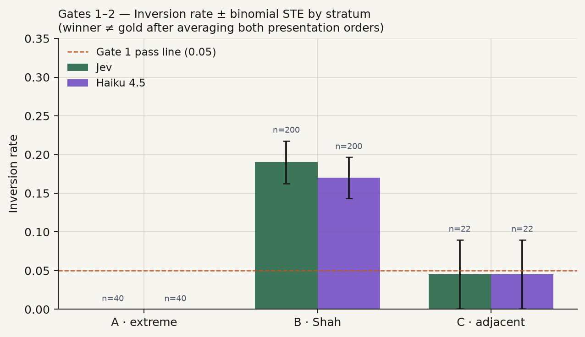

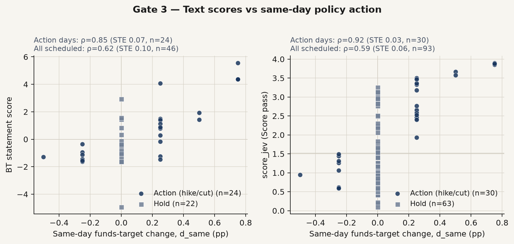

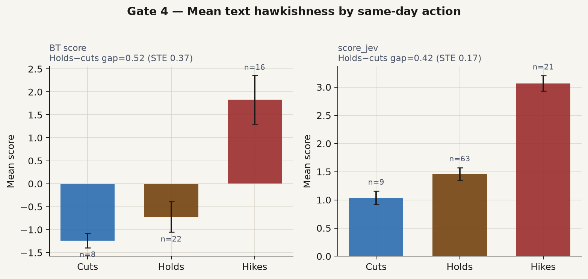

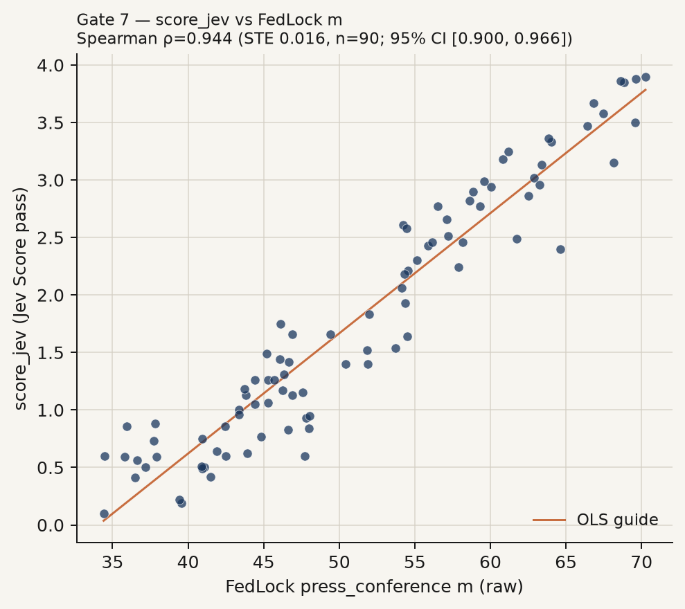

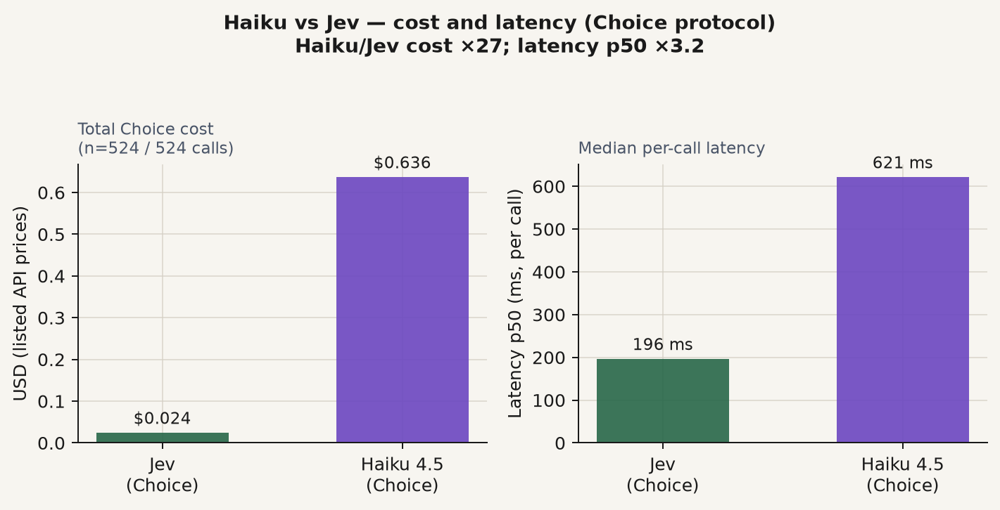

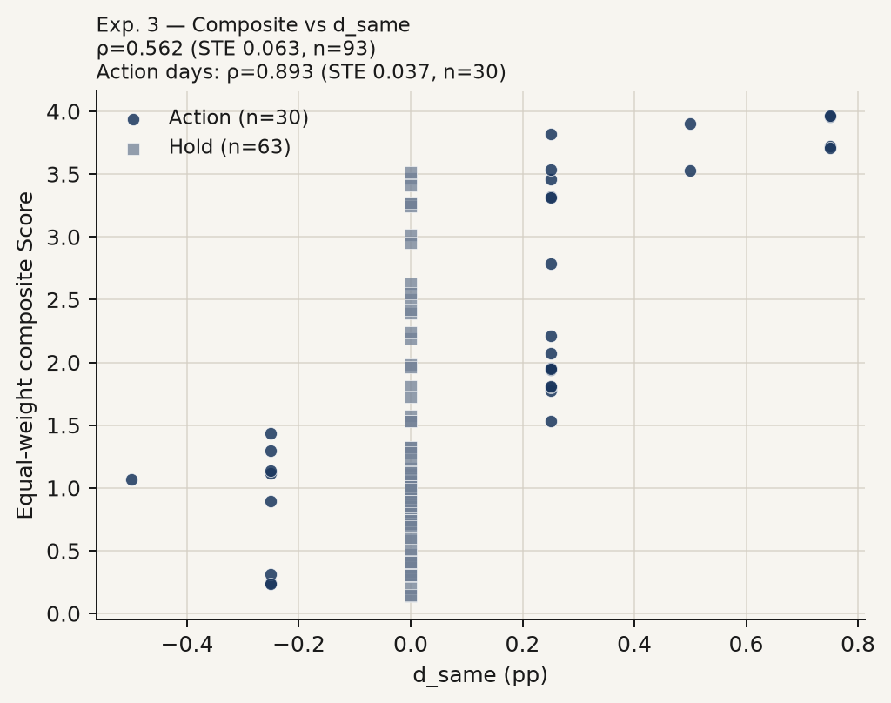

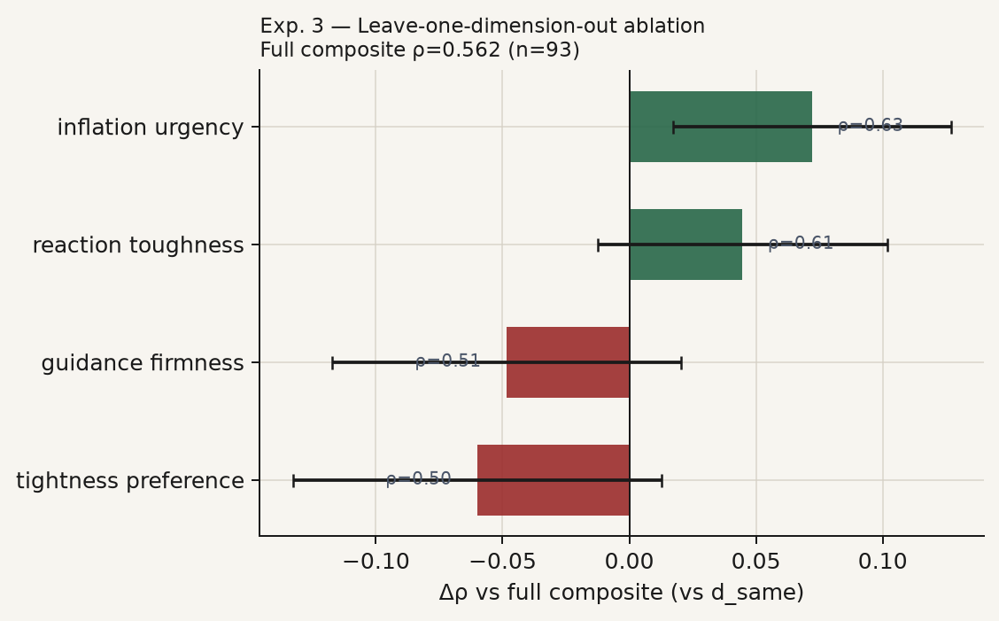

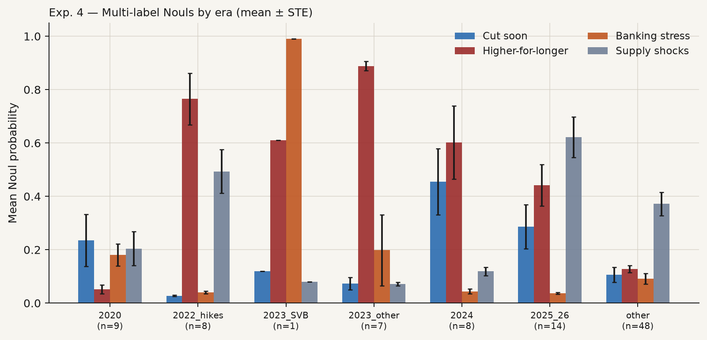

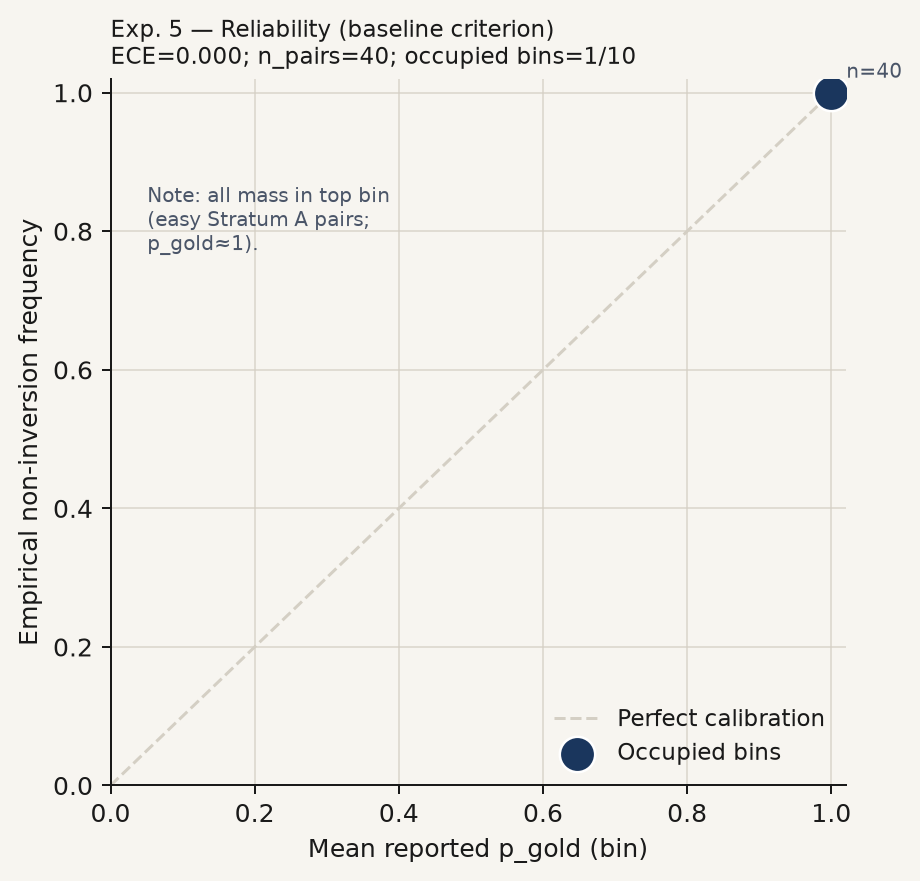

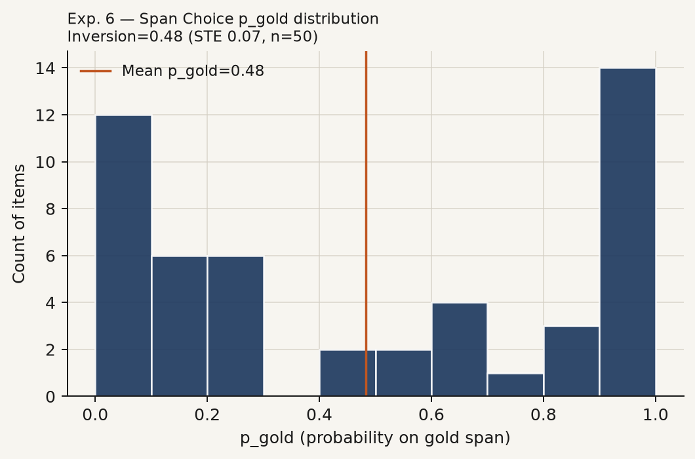

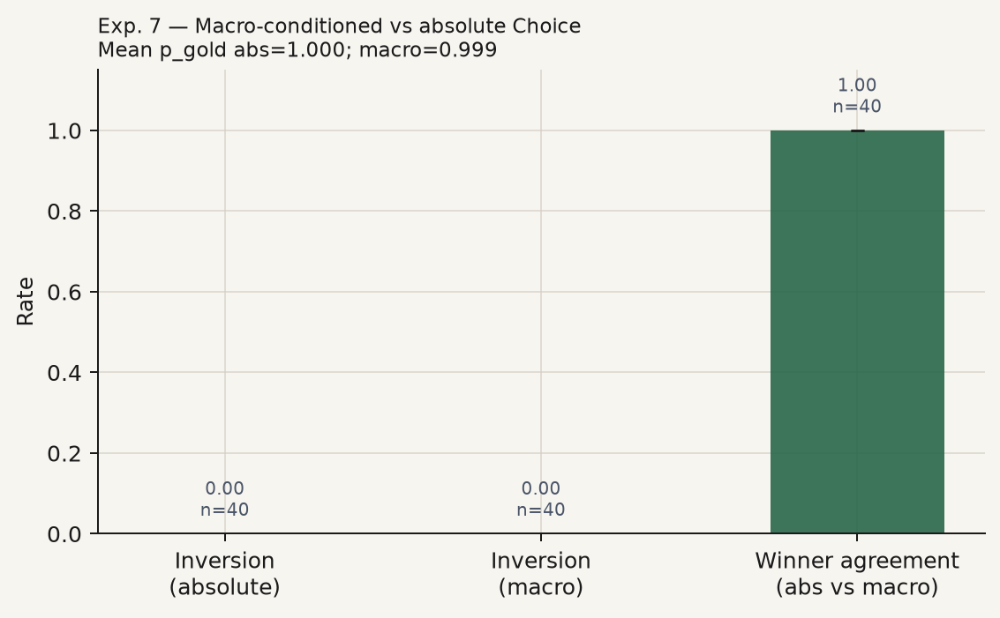

## 12. FedLock-faithful protocol replication (separate experiment)

**run_id:** `fedjev-fedlock-replica-2026-09-20`  
**Scope:** Separate experiment on the 95 chair-opening corpus. Faithful protocol relative to FedLock V3 documentation; **not** a 4k-speech / ~60k-comparison scale replication. Does not replace Gate 7 (external consistency under the main BT/Score protocol).

### Methods
The judge task follows FedLock V3: pairwise selection of the more hawkish monetary-policy stance **conditional on macroeconomic conditions** attached to each text (Core PCE from PCEPILFE year-over-year when computable else level; UNRATE; real GDP growth from GDPC1 quarter-over-quarter SAAR when available else year-over-year; VIXCLS). Texts are anonymized via `scripts/strip_meta.py` (speaker titles, dates, and chair surnames removed); Chair identity is not placed in judge state.

Aggregation uses Microsoft TrueSkill with priors μ₀=50, σ₀=8.33, stopping when all σ<2.0 or approximately 30 comparisons per document (global cap 2,850). Pairing is Swiss-style with uncertainty targeting (prefer high-σ players and similar μ). Soft probabilities from the judge update ratings by outcome interpolation (confidence-weighted). Presentation order of Text A/B is randomized each match.

Arms: (i) TypeSafe SystemOne Choice (`jev-latest`); (ii) Claude `claude-haiku-4-5-20251001` with structured JSON winner and soft probabilities; (iii) published FedLock `press_conference` fields `m`, `ma`, `s`, `n` from `data/raw/fedlock/data.json` (Llama not re-invoked).

FedLock date matching (deltas 0, +1, −1, +2 on `d`): **92** of 95 openings matched.

### Protocol deviations / notes

- Corpus is 95 chair openings (jsort-style), not FedLock’s ~4k-speech pool.
- Soft TrueSkill via outcome interpolation of rate_1vs1 under judge p_A / p_B (confidence-weighted).
- VIXCLS and GDPC1 downloaded into data/raw/fred/ for this experiment (full macro set).
- One Haiku comparison failed JSON parse mid-tournament (truncated rationale); round continued with 46 pairs. Parser later hardened.
- Both arms stopped on all σ<2.0 (~22 comparisons per document on average), below the 30/doc and 2,850 global caps.

### Results
### Rank agreement

- **Jev↔Haiku.** Spearman=+0.955 (STE=0.012; 95% CI [+0.923, +0.971]; n=95); Kendall=+0.830 (STE=0.023; 95% CI [+0.784, +0.873]; n=95).
- **Jev↔FedLock m.** Spearman=+0.965 (STE=0.011; 95% CI [+0.934, +0.978]; n=92); Kendall=+0.850 (STE=0.021; 95% CI [+0.806, +0.888]; n=92).
- **Jev↔FedLock ma.** Spearman=+0.790 (STE=0.044; 95% CI [+0.681, +0.853]; n=92); Kendall=+0.576 (STE=0.043; 95% CI [+0.492, +0.658]; n=92).
- **Haiku↔FedLock m.** Spearman=+0.945 (STE=0.013; 95% CI [+0.910, +0.962]; n=92); Kendall=+0.798 (STE=0.023; 95% CI [+0.753, +0.841]; n=92).
- **Haiku↔FedLock ma.** Spearman=+0.768 (STE=0.042; 95% CI [+0.666, +0.828]; n=92); Kendall=+0.550 (STE=0.042; 95% CI [+0.463, +0.629]; n=92).

### Cost and performance

| Arm | n_comps | input tok | output tok | USD | $/MTok eff. | $/comp | lat mean / p50 / p95 (ms) | comps/s |
|-----|--------:|----------:|-----------:|----:|------------:|-------:|---------------------------:|--------:|
| jev | 1034 | 3376150 | 28768 | 0.1418 | 0.0416 | 0.000137 | 283 / 271 / 419 | 22.978 |
| haiku | 1033 | 3347688 | 48412 | 3.5897 | 1.0570 | 0.003475 | 732 / 687 / 988 | 8.156 |

Jev stop: `all_sigma_lt_2`; max σ=1.986; fraction σ<2=1.000.
Haiku stop: `all_sigma_lt_2`; max σ=1.965; fraction σ<2=1.000.

### Interpretation
Spearman/Kendall concordance between Jev and Haiku under a shared FedLock-style protocol measures cross-judge stability of the relative-hawkishness construct on this openings sample. Concordance with published FedLock `m` / `ma` asks whether the same protocol family, applied to chair openings rather than FedLock’s broader speech corpus and Llama 3.3 70B judge, recovers a similar ordering of meeting-day stance. Era-adjusted `ma` removes quarterly means; disagreement between `m` and `ma` contrasts therefore partly reflects era composition of the 2011–2026 openings window.

Cost and latency columns are accounting facts for the listed prices (Jev $0.042/MTok input, output free; Haiku $1.0/MTok input, $5.0/MTok output). They are not accuracy claims.

### Limitations
- **Scale.** FedLock reports ~60k comparisons on ~4k speeches; this run uses the 95 openings corpus with a ~2,850-comparison cap. Convergence to σ<2 for every document is not guaranteed at this scale.
- **Document mismatch.** Openings are a subset of press-conference communication; FedLock `press_conference` scores may reflect fuller presser text.
- **Judge stack.** FedLock’s published scores use Llama 3.3 70B; this replica uses Jev and Haiku. Agreement with `m`/`ma` mixes protocol fidelity and model differences.
- **Soft TrueSkill.** Confidence-weighted updates via outcome interpolation are a documented approximation to FedLock’s “updates by judge confidence,” not a bit-exact reimplementation of an unpublished update kernel.
- **Macro vintage.** FRED series are taken as-of speech date from the local dump (plus downloaded VIXCLS/GDPC1); real-time vintage differs from revised series.

### Artifacts
- `results/fedlock_replica/trueskill_{jev,haiku}.csv`
- `results/fedlock_replica/comparisons_{jev,haiku}.jsonl`
- `results/fedlock_replica/cost_performance.json`
- `results/fedlock_replica/agreement.json`
- `results/figures/fedlock_replica_*.png` (copied to `docs/figures/`)

Figures: `results/figures/fedlock_replica_*.png` (also under `docs/figures/`).

## 13. Ethics and licenses

| Asset | Status |
|-------|--------|
| Code | MIT |
| FOMC openings | U.S. government works; cite federalreserve.gov; no Fed endorsement |
| FRED | St. Louis Fed terms |
| Shah | CC BY-NC 4.0 — attribution; non-commercial; full dump not vendored |
| jsort | MIT |
| FedLock | Upstream site terms; snapshot for Gate 7 only |

Research instrumentation only; not investment advice.

## Citation

See [`CITATION`](CITATION).
