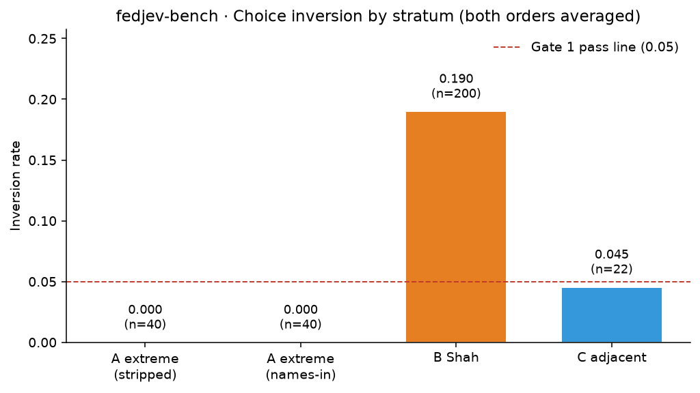
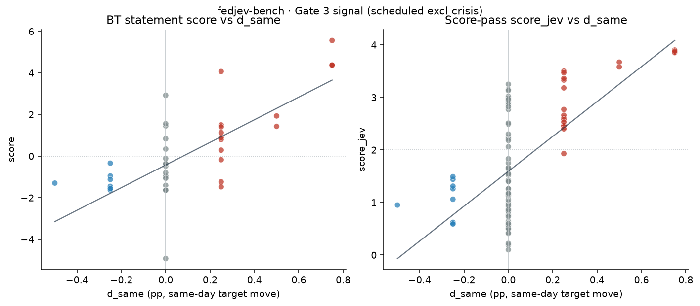

# fedjev-bench — Analysis

**run_id:** `fedjev-2026-09-20`  
**model:** jev-1.13.0 (TypeSafe SystemOne)  
**criterion (exact):** `more hawkish about inflation`  
**repo:** [maybern-tripp-smith/fedjev-bench](https://github.com/maybern-tripp-smith/fedjev-bench)  
**pages:** [https://maybern-tripp-smith.github.io/fedjev-bench/](https://maybern-tripp-smith.github.io/fedjev-bench/)

Companion short report: [`REPORT.md`](REPORT.md). Machine-readable gates: [`results/gates.json`](results/gates.json).

---

## 1. Motivation & thesis

Rate changes label **policy**. Jev labels **text**.

Central-bank watchers often treat the same-day federal-funds target move (`d_same`) as ground truth for how “hawkish” an FOMC communication was. That collapses two different objects:

1. **Policy outcome** — what the Committee voted (hike / hold / cut; dissents).
2. **Communicated stance** — how the Chair’s opening remarks (and related text) talk about inflation, the labor market, and the policy path.

On action days these often move together. On **holds**, and especially across regimes (2020 cuts vs 2022–23 holds with hawkish tone vs 2026 hawkish holds with dissents), they need not. The pre-registered claim of this bench is:

> If a text model can rank obvious hawk documents above obvious dove documents (Gate 1), track the rate series on scheduled action days (Gate 3), and still put **holds above cuts** when `d_same=0` on the hold side (Gate 4), then it is reading **tone**, and the rate series alone is the wrong sole GT.

Gate 4 is therefore not a bug to paper over — it is the result of interest.

---

## 2. Related work

| Work | What it contributes | How we use it |
|------|---------------------|---------------|
| **jsort** ([keltokhy/jsort](https://github.com/keltokhy/jsort)) | Fed statement ranking / `bench/fed.py` label formulas; published Spearman vs same-day move ≈ **+0.46** | Label construction (`d_same`, `d_90`, `d_2y`); Gate 3 signal line (+0.30) and published reference (+0.46) |
| **Shah et al. FOMC hawkish-dovish** ([gtfintechlab/fomc-hawkish-dovish](https://github.com/gtfintechlab/fomc-hawkish-dovish); CC-BY-NC 4.0) | Sentence-level labels 0=dovish, 1=hawkish, 2=neutral | Stratum B pairs (hawk vs dove sentences); Gate 2 report-only |
| **FedLock** ([jnathan9.github.io/fedlock](https://jnathan9.github.io/fedlock/)) | Independent hawkishness scores for press conferences / speeches | Gate 7 consistency check (report-only) |

This bench adds: (i) a frozen three-stratum gold set, (ii) TypeSafe/Jev Choice with **both presentation orders**, (iii) Bradley–Terry aggregation on statement pairs, (iv) pre-registered pass lines, and (v) **cost/latency as first-class artifacts**.

---

## 3. Data

### Corpora

| Corpus | Path | Role |
|--------|------|------|
| Chair presser openings | `data/clean/statements.jsonl` (~95 docs) | Document-level Choice + Score |
| Shah sentences | `data/clean/sentences.jsonl` | Stratum B |
| Meeting calendar + FRED labels | `data/labels/meetings.parquet` | `d_same`, `d_90`, `d_2y`, dissent counts, exclusions |
| FedLock snapshot | `data/raw/fedlock/data.json` | Gate 7 |
| FRED CSVs | `data/raw/fred/` | DFEDTARU, DGS2 (no API key) |

Statements are drawn from federalreserve.gov press conference openings (public U.S. government works; see [`DATA.md`](DATA.md)). Shah raw dumps are **not** redistributed in the public tree (CC-BY-NC); we ship attribution + download instructions and the derived `sentences.jsonl` used for this run.

### FRED labels (aligned with jsort `bench/fed.py`)

- `d_same` = DFEDTARU[t+1] − DFEDTARU[t−1] (pp; new range effective next day)
- `y_action` = sign(`d_same`) ∈ {+1, 0, −1}
- `d_90` = DFEDTARU[t+90] − DFEDTARU[t] (when history allows)
- `d_2y` = DGS2[t] − DGS2[t−1]
- `n_hawk_dissent` / `n_dove_dissent` from “Voting against …” paragraphs (best-effort)

### Exclusions (pre-registered)

- **Exclude from main analysis:** 2020-03-03, 2020-03-15 (unscheduled / intermeeting cuts) and any other `is_scheduled=false` / `exclude_main` rows.
- **Flag, do not drop:** 2023-03-22 (SVB) — `flag_svb=true`.

### Pair strata (frozen before any Jev call)

| Stratum | source | n | Construction |
|---------|--------|--:|--------------|
| A — easy | `extreme` | 40 | 50–75 bp hike openings vs Mar 2020–Jan 2021 ease/hold-at-zero; gold = hike side |
| B — Shah | `shah` | 200 | Hawkish vs dovish sentences only; seed **20260920** |
| C — adjacent | `adjacent` | 22 | Consecutive scheduled meetings with statements; gold when sign(Δ `d_same`) ≠ 0 |

Manifest: `data/pairs/PAIR_MANIFEST.md`. **Do not mutate** `data/pairs/gold_pairs.jsonl` after scoring starts.

---

## 4. Method

### Choice (primary)

- Criterion string (exact): **`more hawkish about inflation`**
- Prompt: “Which of Text A or Text B is more hawkish about inflation”
- Options: Text A / Text B
- Meta stripping via `scripts/strip_meta.py` (speaker names, titles, meeting dates → placeholders) for the main run
- **Both presentation orders** `ab` and `ba`; probabilities mapped back to original gold sides and averaged
- Inversion = averaged winner ≠ gold

### Score (secondary)

Five levels: much more dovish / somewhat dovish / neutral / somewhat hawkish / much more hawkish → continuous `score_jev` on statements.

### Bradley–Terry (BT) fit

- Inputs: Stratum **A + C** Choice probabilities (Shah excluded — sentence-level)
- Fit yields per-statement `score` (+ SE, n_pairs) in `results/statement_scores.csv`
- This run: n_statements=**48**, n_comparisons=**124**, converged=True, position bias γ=**−0.1378**
- Graph is **sparse** relative to a complete tournament — interpret SE and hold-day correlations with that in mind

### Caching

Answers under `runs/jev/cache/`. Cache key material includes model, criterion, text hashes, and order. Gate 6 name ablation appends `|names=1` so unstripped calls never collide with stripped cache.

### Entry points

```bash
export TYPESAFE_API_KEY=...   # env only
python score.py --live --full
python scripts/run_name_ablation.py --live   # Gate 6
python scripts/analyze_gates.py
```

---

## 5. Pre-registered gates

| # | Gate | Metric / rule | Pass line |
|---|------|---------------|-----------|
| 1 | Easy-pair inversion | Stratum A; both orders | inversion ≤ 0.05 |
| 2 | Sentence discrimination | Stratum B; inversion + Brier | **report only** |
| 3 | Statement score vs action | Spearman(BT score, `d_same`) scheduled excl crisis; action vs hold splits | Spearman ≥ +0.30 (signal); jsort pub. +0.46 |
| 4 | Holds vs cuts | mean score holds (`d_same=0`) vs cuts (`d_same<0`) | mean(holds) > mean(cuts) |
| 5 | Forward path | Spearman vs `d_90` | **secondary** |
| 6 | Order/name stability | Stratum A with names in + order flip; Δ inversion | Δ inversion ≤ 0.05 |
| 7 | FedLock consistency | Spearman vs FedLock hawkishness | **report only** |

---

## 6. Results

### Verdict

| # | Gate | Result | Detail |
|---|------|--------|--------|
| 1 | Easy-pair inversion | **PASS** | rate=0.0000 (n=40, inverted=0) |
| 2 | Sentence discrimination | report | inv=0.1900, Brier=0.1384, p(gold)=0.7451 (n=200) |
| 3 | Action ranking | **PASS** | BT all=+0.623 (n=46); action_days=+0.851 (n=24) |
| 4 | Holds vs cuts | **PASS** | BT: holds=−0.720 (n=22) > cuts=−1.239 (n=8); gap=0.519 |
| 5 | Forward path | secondary | BT vs d_90=+0.357 (n=44); score_jev=+0.511 (n=91) |
| 6 | Order/name stability | **PASS** | names-in inv=0.000; baseline=0.000; **Δ=0.000** |
| 7 | FedLock consistency | report | BT=+0.685 (n=46); score_jev=+0.946 (n=90) |

### Inversion by stratum



| Stratum | n | inverted | inversion | mean p(gold) | mean Brier | order-flip |
|---------|--:|--------:|----------:|-------------:|-----------:|-----------:|
| A extreme (stripped) | 40 | 0 | 0.000 | 1.000 | 0.000 | 0.000 |
| A extreme (names-in) | 40 | 0 | 0.000 | 1.000 | 0.000 | 0.000 |
| B Shah | 200 | 38 | 0.190 | 0.745 | 0.138 | 0.105 |
| C adjacent | 22 | 1 | 0.045 | 0.856 | 0.046 | 0.091 |

Inverted C pair: **C018**. Stratum A: none.

### Gate 3 — action ranking (deeper)



| Slice | BT Spearman ρ [95% CI] | n |
|-------|------------------------|--:|
| All scheduled (excl crisis) | +0.623 [+0.398, +0.787] | 46 |
| action_days (`d_same`≠0) | +0.851 [+0.652, +0.937] | 24 |
| hold_days vs (n_hawk−n_dove) | −0.192 [−0.513, +0.274] | 22 |
| hold_days vs `d_2y` | −0.135 [−0.594, +0.349] | 22 |

Secondary `score_jev`: all=+0.589 (n=93); action=+0.918 (n=30).

**Reading:** On action days Jev’s BT ranking tracks the rate move tightly (ρ≈0.85), clearing both the +0.30 signal line and jsort’s published +0.46 reference. On **holds**, neither net dissent nor same-day 2y yield change correlates cleanly with BT scores — expected if holds mix hawkish-hold and dovish-hold communications while `d_same` is identically zero.

### Gate 4 — holds vs cuts (the thesis gate)

| Score | mean holds (n) | mean cuts (n) | mean hikes (n) | gap (holds−cuts) |
|-------|----------------|---------------|----------------|------------------|
| BT | −0.720 (22) | −1.239 (8) | +1.827 (16) | **+0.519** |
| score_jev | 1.457 (63) | 1.036 (9) | 3.067 (21) | +0.421 |

Holds sit **above** cuts on the hawkishness axis even though both can have `d_same≤0` on the cut side and `d_same=0` on holds. That is exactly the rate-label / text-label disagreement the bench was built to surface: 2023–26 hawkish holds (and hawkish-hold-with-dissents) are not “as dovish as 2020 cuts” in the text, and Jev says so.

### Gate 2 / Shah — 19% errors

Stratum B inversion **19%** (38/200) with mean p(gold)=0.745 is far from random (50%) but not near the document-level A/C ceiling. Likely contributors:

- Sentence fragments lose document context (hedges, conditionals, “however” clauses).
- Shah labels are themselves model/human judgments with residual noise.
- Short texts → higher Choice entropy; order-flip rate 10.5% supports that.

Treat Gate 2 as a **discrimination stress test**, not a pass/fail of the document thesis.

### BT sparsity (n=48 statements)

Only 48 statements enter the BT graph via 124 A+C comparisons. Many meetings appear in few edges; SEs are non-trivial. Gate 3/4 primary metrics therefore use BT where available and report `score_jev` (95 docs, direct Score pass) as a denser secondary. Expanding adjacent and cross-regime pairs would densify the graph in a follow-up run — **without** unfreezing the current gold set for this `run_id`.

### Gate 6 — name ablation

Re-ran Stratum A Choice both orders with **`raw_text` unstripped**; cache keys include `|names=1`.

| | |
|--|--:|
| Baseline inversion (stripped) | 0.000 |
| Names-in inversion | 0.000 |
| **Δ** | **0.000** ≤ 0.05 → **PASS** |
| Add-on cost | $0.010955 (80 calls, 260,824 input tokens) |

Caveat: presser openings rarely embed Chair names/ISO dates in-body, so `strip_meta` edits are small for most Stratum A docs. The ablation still confirms order-stable judgments under the unstripped presentation and isolates the cache namespace.

### Gate 7 — FedLock

BT vs FedLock hawkishness ρ=+0.685 (n=46); `score_jev` ρ=+0.946 (n=90). Independent text scores agree with Jev — especially the direct Score pass — supporting that we are not merely fitting FRED noise.

---

## 7. Cost & latency (first-class)

Pricing (**jev-1.13.0**): **$0.042 / Mtok input**; output free ([TypeSafe pricing](https://typesafe.ai)).

### Main run

| | |
|--|--:|
| Total USD | $0.031204 |
| Input tokens | 742,941 |
| Output tokens | 18,049 (free) |
| n_calls | 619 (524 Choice + 95 Score) |
| USD / gold pair | $0.000119 |

By stratum: extreme $0.01096; shah $0.00675; adjacent $0.00605; score_docs $0.00744.

### Name ablation add-on

| | |
|--|--:|
| USD | $0.010955 |
| Calls | 80 |
| Input tokens | 260,824 |
| Wall (concurrency=6) | ~3.5 s |

**Grand total (main + ablation):** ≈ **$0.04216**.

### Latency

Concurrency 6. Per-call mean ≈ 214 ms (main); p95 ≈ 321 ms. Approx wall if perfect parallel ≈ 22 s for the main 619 calls (sum latency / 6).

Artifacts: `results/cost.json`, `results/timing.json`, `results/name_ablation.json`.

---

## 8. Limitations

1. **Dissent scrape partial** — ~10/124 meetings remain `against_unclear`; hold-day dissent correlations are noisy.
2. **Presser gaps** — meetings without openings keep URL patterns (may 404); Score/BT coverage ≠ full calendar.
3. **BT sparsity** — n=48 statements / 124 comparisons; prefer CIs and secondary `score_jev` when interpreting holds.
4. **Name ablation low contrast** — openings seldom contain strip-able names/dates; Δ=0 is informative for order stability more than for “names as confounders.”
5. **Shah NC license** — public tree does not vendor the full upstream dump; reproduce Stratum B from upstream + our pair freeze.
6. **Single criterion / model** — results are for `more hawkish about inflation` on jev-1.13.0 only.
7. **Forward path (`d_90`)** — secondary; recent meetings lack 90-day follow-through.

---

## 9. Reproducibility

```bash
git clone https://github.com/maybern-tripp-smith/fedjev-bench
cd fedjev-bench
python -m venv .venv && source .venv/bin/activate
pip install typesafe-sdk pandas pyarrow openpyxl scipy matplotlib

# Data half (pairs already frozen for this run_id — do not rebuild gold)
# Optional refresh: scripts/prepare_*.py, prepare_meetings_labels.py

export TYPESAFE_API_KEY=ts_...     # from https://typesafe.ai — never commit
python score.py --live --full      # or rely on committed runs/jev/cache
python scripts/run_name_ablation.py --live
python scripts/analyze_gates.py
```

Frozen inputs: `data/pairs/gold_pairs.jsonl`, `data/clean/`, `data/labels/`.  
Outputs: `results/`, `runs/jev/`, `REPORT.md`, this file.

---

## 10. Ethics / data license notes

| Asset | License / status | Notes |
|-------|------------------|-------|
| Code in this repo | **MIT** (`LICENSE`) | |
| FOMC statements / pressers | U.S. government works (public domain-ish) | Cite federalreserve.gov; no Fed endorsement implied |
| FRED series | St. Louis Fed terms | CSV via `fredgraph.csv`; attribute FRED |
| Shah hawkish-dovish | **CC BY-NC 4.0** | Attribution required; non-commercial; see `DATA.md` for download |
| jsort | MIT | Cite Eltokhy / keltokhy/jsort |
| FedLock | Upstream site terms | Snapshot for Gate 7 only |
| TypeSafe / Jev outputs | Your API agreement | Do not commit API keys |

This project is research instrumentation, not investment advice. Hawkish/dovish labels are model judgments under a fixed criterion string.

---


---

## 11. Comparison — Claude Haiku 4.5 vs Jev

Full Choice re-run of all **262 gold pairs × both orders** with meta-stripped text and criterion `more hawkish about inflation`.

| | Jev 1.13.0 | Haiku 4.5 (`claude-haiku-4-5-20251001`) |
|--|------------|----------------------------------------|
| Protocol | TypeSafe SystemOne Choice | Anthropic Messages → JSON `{winner,p_A,p_B}` |
| Pricing | $0.042 / Mtok in (out free) | $1 / Mtok in · $5 / Mtok out |
| n Choice calls | 524 | 524 |
| Choice USD | **$0.0238** | **$0.6363** |
| USD / gold pair | $0.000091 | $0.00243 (~27×) |
| Mean latency | **207 ms** | **676 ms** (~3.3×) |
| p50 / p95 latency | 196 / 304 ms | 621 / 938 ms |
| Input tokens | ~566k (Choice strata) | 500,252 |
| Output tokens | ~16.2k (free) | 27,208 ($0.136) |


### Inversion (both orders averaged)

| Stratum | Jev inv | Haiku inv | Δ (H−J) | Jev Brier | Haiku Brier | Jev order-flip | Haiku order-flip |
|---------|--------:|----------:|--------:|----------:|------------:|---------------:|-----------------:|
| A extreme | 0.000 | 0.000 | 0.000 | 0.000 | 0.0005 | 0.000 | 0.000 |
| B Shah | 0.190 | **0.170** | −0.020 | 0.138 | 0.144 | 0.105 | 0.240 |
| C adjacent | 0.045 | 0.045 | 0.000 | 0.046 | 0.109 | 0.091 | 0.091 |

### Takeaways

1. **Accuracy:** On easy document pairs (A) and adjacent statements (C), both models match (0% / 4.5% inversion). On Shah sentences (B), Haiku is slightly better (17% vs 19%) but with **much higher order-flip** (24% vs 10.5%) — less presentation-stable despite the edge on averaged winners.
2. **Calibration / Brier:** Jev’s document-level Brier on A/C is near-perfect; Haiku’s C Brier is worse (0.109 vs 0.046) even when inversion ties — probabilities are softer / less peaked.
3. **Speed:** Jev Choice mean latency ~3.3× lower (207 vs 676 ms) under similar concurrency regimes (Jev 6 / Haiku 8).
4. **Price:** Jev Choice is ~**27× cheaper** per gold pair at the listed list prices. Haiku’s absolute spend for this bench was still modest ($0.64) and intentionally not price-gated.
5. **Protocol caveat:** Jev returns native Choice probabilities from SystemOne; Haiku probabilities are model-reported JSON. Inversion (winner) is the fairest head-to-head metric; treat Brier as secondary.

Artifacts: `results/haiku_comparison.json`, `results/haiku_pair_judgments.jsonl (alias: pair_judgments_haiku.jsonl)`, `runs/haiku/`, `results/haiku_cost.json`, `results/haiku_timing.json`.

```bash
export ANTHROPIC_API_KEY=...
python scripts/run_haiku_comparison.py --live --concurrency 8
```


## Citation

See [`CITATION`](CITATION). Short form:

> Smith, T. (2026). *fedjev-bench*: TypeSafe/Jev hawkishness ranking on FOMC text (`fedjev-2026-09-20`). https://github.com/maybern-tripp-smith/fedjev-bench
